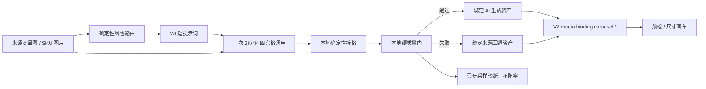

# 产品处理图片质量与提示词收敛设计

**状态：** 待实施评审  
**适用范围：** 仅策略上线后的新产品处理任务；不迁移、不回填、不修改历史图片或任务。  
**替代关系：** 本文替代旧方案中的“坏格同步 1K 补图”和“普通四宫格整体重试”。一次四宫格远程调用与本地确定性拆分保留。

## 背景与根因

当前普通任务在 `ProductProcessingService._generate_grid_images()` 中把完整图片模板、内容参考、`GRID_RUNTIME_CONTRACT` 和布局脚手架一起交给中转。拆分后的质量门只检查 OCR 可见文字；OCR 不合格时，会同步调用一次 `gpt-image-2-1k` 定向补图。

因此问题不只是“提示词不够严格”。

- A 模板同时要求商品完整、8%--12% 安全边距、72%--88%画面占比，且主图又要求 68%--82%。细长、异形、多部件商品无法稳定同时满足这些条件。
- A 默认允许成人手，B 还把“人物/空间故事、反比价独特性”放在商品准确性之前；这是手指畸形、遮挡和商品形变的直接风险。
- `MediaProcessor` 目前在 `layout_scaffold=True` 时将四宫格脚手架置于来源商品图之前；普通四宫格默认只取一张真实商品图。若中转对首图权重较高，版式会压过 SKU 身份。
- OCR 无法判断缺边、错误手部、错误背景等视觉语义问题；让慢中转同步重试或再做一次同步 VLM 判图，只会放大尾延迟。

## 目标与边界

### 目标

1. 将默认四宫格收敛为稳定商品素材生产：商品完整、一致、可预检、可进入尺寸画布。
2. 每商品最多一次远程四宫格调用；质量失败不增加同步远程调用。
3. 对可确定失败立即以可信来源素材填充对应槽，仍产出四张可用轮播素材。
4. 记录模板版本、风险路由、参考输入顺序、每槽决策和降级原因，支持运营定位与 A/B。
5. 所有生成与回退素材继续通过 V2 media asset registry 的 `asset_id` 流转，URL 只展示。

### 非目标

- 不承诺提示词能够识别或修复所有扩散模型视觉缺陷。
- 不在预检主链路引入同步 VLM 复检、自动二次生图或人工阻塞审批。
- 不改写任何历史任务 `result_json` 或历史资产绑定。
- 不取消一次生成四宫格、本地拆分的成本模型。

## 已确认的产品决策

| 决策 | 规则 | 原因 |
| --- | --- | --- |
| 默认人物策略 | 默认禁止人物、手、手指、脸和身体部位；第三格改为无人情境静物图。 | 直接移除最常见且最难稳定的畸形源。 |
| 约束优先级 | SKU 身份与完整性 > 不裁切/安全边距 > 无新增文字 > 四格可拆分 > 场景与质感。 | 冲突时允许背景简化，绝不允许商品变形。 |
| 失败策略 | 硬质量门失败即来源回退；该任务内不重试。 | 中转慢，稳定可用优先于长时间等待。 |
| 人物模式 | 仅显式 `human_lifestyle` 策略可用，默认关闭。 | 复杂内容不能隐式进入日常入池。 |
| 语义审查 | P0 仅异步采样或人工复核，不改变已完成任务。 | 语义判断不能成为吞吐瓶颈。 |

## 目标链路



### 生成画像：完全本地、保守选择

新增 `GridGenerationProfile`，只读取既有 `raw`、标题、类目、风险标签和来源图数量：

| 画像 | 触发 | 四格内容 |
| --- | --- | --- |
| `product_safe` | 默认 | 主图、替代角度、无人情境、尺寸留白图；全程无人物/手。 |
| `fragile_product` | 细长、透明、异形、多组件、带文字、来源图少于两张等 | 四格均为纯商品构图，商品占比降低，留白增大，无复杂道具。 |
| `human_lifestyle` | 明确运营选择且类目许可 | 仅第三格可出现人体；P0 不自动启用。 |

不确定时一律进入 `fragile_product`。规则与命中原因写入结果，第一版不调用 AI 来决定风险。

### V3 提示词合同

新增 `grid_image_v3`，`prompt_version` 固定记录为 `grid-v3`。新任务默认不再走 B 的“角色人格、反比价、自由创作”导向；A/B 保留为历史兼容、显式回切选项。

固定合同控制在约 20--30 条，核心语义必须为：

```text
Priority: exact source SKU identity and complete visible product > safe margins > no added text > four independent panels > styling.
Use source product image(s) as the only authority. Never change, remove, add, hide, crop, reshape, recolor, merge, or invent sellable parts.
When any styling instruction conflicts with product accuracy or full visibility, simplify the scene and preserve the product.
Render no person, face, hand, finger, body part, model, or human reflection unless profile is human_lifestyle.
Each panel must contain the complete sellable product inside its own safe margin. Never force a minimum product occupancy that would crop a long or irregular product.
```

四格只保留一个目标和两项限制：

1. `hero`：完整商品、干净不抢主体的背景；
2. `detail`：完整商品的替代角度，不允许纯微距或 inset；
3. `unmanned_lifestyle`：无人的静物使用情境，道具不能遮挡商品；
4. `dimension_background`：完整商品、15%--20%留白、无尺寸标记。

商品占比为默认约 55%--70%、`fragile_product` 约 45%--60%；任何情况下“完整可见”优先于占比。

### 参考图与脚手架

输入分为真实 `product_reference` 和 `layout_scaffold`。默认将最多两张可信商品图放在前，脚手架在后；用 `WH_PRODUCT_GRID_REFERENCE_ORDER=source_first|scaffold_first` 保留回切。因为不同中转可能对首图权重不同，必须先在固定样本上 A/B，再确定默认值。

### 硬质量门与来源回退

质量门只做本地可确定、低延迟检查：可解码、尺寸/四格拆分成功、每槽非空、OCR 无新增显著文字、布局边界合法。它不声称判断手是否自然或商品是否少角。

| `decision` | 条件 | 下游行为 |
| --- | --- | --- |
| `generated_accepted` | 生成图通过硬门 | 绑定 `ai_generated` 资产。 |
| `source_fallback` | 生成、拆分或硬门失败 | 绑定可信来源资产，任务仍完成。 |
| `source_unavailable` | 没有可信来源可回退 | 任务为 `attention_required`，禁止进入预检。 |

同一来源可填充多个槽位，但必须显式标为 `source_fallback`；不能伪装成多张生成成功图。视觉语义问题在 P0 只做采样记录，预检允许运营一键切来源图或非主链路人工重生单格。

### 可追溯数据合同

新任务 `result` 追加下列结构，并将每槽 decision 写入 V2 binding 元数据：

```json
{
  "image_generation": {
    "prompt_version": "grid-v3",
    "profile": "product_safe",
    "profile_reasons": ["default_safe"],
    "reference_order": "source_first",
    "reference_count": 1,
    "remote_call_count": 1,
    "slot_decisions": [
      {"slot_id": "carousel.hero", "decision": "generated_accepted", "reason_codes": []},
      {"slot_id": "carousel.detail", "decision": "source_fallback", "reason_codes": ["ocr_prominent_text"]}
    ]
  }
}
```

同时保留既有兼容字段。`provider_attempts.four_grid` 必须是真实远程调用数，回退不增加它；`ai_notes` 增加稳定标记，例如 `four_grid:profile:fragile_product` 和 `four_grid:slot:2:source_fallback:ocr_prominent_text`。

## 预检、画布和运营闭环

- 轮播继续绑定 `carousel.hero/detail/lifestyle/dimension_background`；画布只按 `asset_id` 读取。
- 预检卡片显示“AI 生成”“来源图兜底”“待人工处理”；已就绪的来源回退资产同样可进入尺寸画布。
- “人工重生此格”必须是独立异步动作，创建替代资产/绑定，不影响其他三格，也不由主任务自动触发。
- P1 再从预检操作积累“接受生成 / 使用来源 / 人工重生”标签；每日抽样 5% 做异步视觉评审或人工质检，只写诊断，不阻塞已有结果。

## 分期、验收与回滚

### P0 稳定性基线

1. 增加本地画像、V3 无人物默认模板、参考顺序开关；
2. 删除主链路的同步 1K 补图与整体重试；
3. 加入逐槽来源回退、资产绑定元数据和预检标签；
4. 灰度为 0% 影子评估、10%、50%、100%，每档至少 30 个不同类目新商品。

### 验收

- 每个新任务最多一次远程四宫格调用；OCR/拆分失败不得触发同步 1K 补图。
- 每个完成任务都有四个 `ready` 的 `carousel.*` 资产绑定。
- 默认 prompt 无人物/手部要求，B 不作为新任务默认路径。
- 缺图、OCR 或拆分失败时显示来源兜底；无可信来源时明确 `attention_required`。
- 画布可以导入生成资产和回退资产。
- P95 `grid_pipeline` 不增加，`remote_call_count` 中位数为 1。

### 回滚

仅切换新任务开关，不删除资产、不改写结果：

- `WH_PRODUCT_GRID_PROMPT_VERSION=grid-v3|legacy`
- `WH_PRODUCT_GRID_REFERENCE_ORDER=source_first|scaffold_first`
- `WH_PRODUCT_GRID_AUTO_SLOT_REPAIR=0`（P0 固定为 `0`）
- `WH_PRODUCT_GRID_HUMAN_LIFESTYLE_ENABLED=0`（P0 固定为 `0`）
