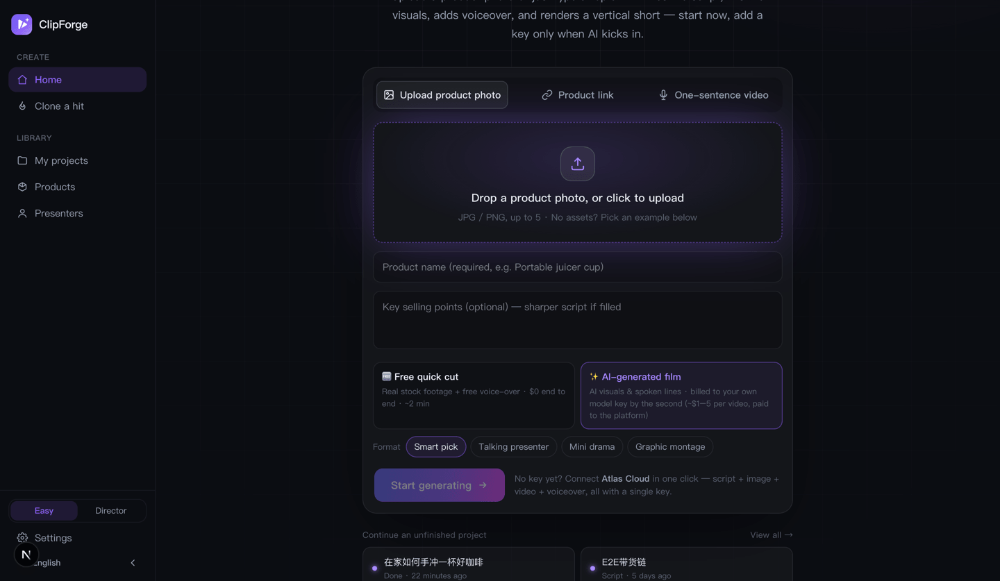
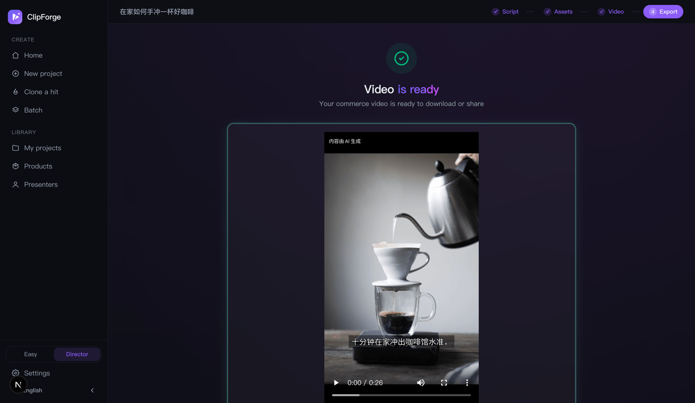
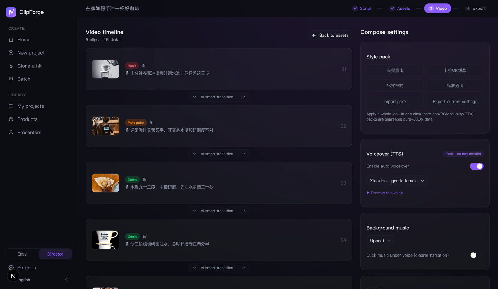

<p align="right"><strong>English</strong> · <a href="TUTORIAL.md">中文</a></p>

# ClipForge User Tutorial (beginner edition — every step spelled out)

> **The one-line version:** install → add one key for script writing → two clicks → a vertical, watermark-free video you can post, in 1–3 minutes. **The whole path works at $0.**

This is written for people who have **never used the tool and don't know how to edit video**. Every step tells you **what to click, what you'll see, and what to do when it breaks**.

Still stuck afterwards → [open an Issue](https://github.com/xixihhhh/clipforge/issues) or [start a Discussion](https://github.com/xixihhhh/clipforge/discussions). English or Chinese, both fine.

---

## Contents

1. [The map: what you're about to do](#1-the-map-what-youre-about-to-do)
2. [Glossary (30 seconds, then everything below reads easily)](#2-glossary-30-seconds-then-everything-below-reads-easily)
3. [Step 1 — Install ClipForge (pick one of three)](#3-step-1--install-clipforge-pick-one-of-three)
4. [Step 2 — Add one key for script writing (the only required setup)](#4-step-2--add-one-key-for-script-writing-the-only-required-setup)
5. [Step 3 — Your first video in 3 minutes (free quick cut, $0)](#5-step-3--your-first-video-in-3-minutes-free-quick-cut-0)
6. [Step 4 — Download, publishing copy, AI labeling](#6-step-4--download-publishing-copy-ai-labeling)
7. [Next level 1 — AI-generated film (read before you spend)](#7-next-level-1--ai-generated-film-read-before-you-spend)
8. [Next level 2 — Director mode, page by page](#8-next-level-2--director-mode-page-by-page)
9. [Next level 3 — Products / batch / clone a hit / daily posting](#9-next-level-3--products--batch--clone-a-hit--daily-posting)
10. [Next level 4 — Let an AI assistant or the CLI make videos for you](#10-next-level-4--let-an-ai-assistant-or-the-cli-make-videos-for-you)
11. [Troubleshooting table](#11-troubleshooting-table)
12. [Where your data lives, backups, uninstalling](#12-where-your-data-lives-backups-uninstalling)
13. [Still stuck? Ask like this and you'll get unblocked fastest](#13-still-stuck-ask-like-this-and-youll-get-unblocked-fastest)

---

## 1. The map: what you're about to do

```
                 ┌────────────────────────────────────────────┐
  Install        │ Desktop app / one Docker line / from source │
                 └────────────────────────────────────────────┘
                                    ↓
                 ┌────────────────────────────────────────────┐
  Add 1 key      │ Used only to write the script (~$0.0002)    │  ← the only must-do
                 └────────────────────────────────────────────┘
                                    ↓
        Home: upload a product photo / paste a link / type a topic
                                    ↓
             Pick a path (this is where money is or isn't spent)
                     ╱                             ╲
        🆓 Free quick cut                    ✨ AI-generated film
   Real stock footage + free voice        AI visuals + AI spoken presenter
   $0 end to end, ~2–3 min                Billed per second, ~4–8 min
                     ╲                             ╱
                                    ↓
              "Script ready" — read the copy free, then confirm
                                    ↓
        Finished video: 1080p vertical, no watermark → download + copy captions
```

**Two sentences are all you need to remember:**

- **Writing the script needs a key; rendering the video doesn't.** Free quick cut's footage, voice-over and composition are all free.
- **Spending is exactly one click.** The script is always generated for free first; billing starts only when you press "Generate with AI".

---

## 2. Glossary (30 seconds, then everything below reads easily)

| Term | In plain words |
|---|---|
| **Key / API key** | A secret string (like `sk-xxxx`) you get after signing up with an AI platform. **You pay that platform directly — ClipForge never takes a cut and never handles your money.** |
| **BYOK** | Bring Your Own Key. ClipForge is free and open source; AI usage is billed by the platform you chose. |
| **LLM** | The text model (DeepSeek, GPT, …). Here it only **writes the spoken script**. |
| **Voice-over / narration** | The words spoken in the video. |
| **Shot** | One small segment of the video: one line of narration + one visual. |
| **Hook** | The first 3 seconds — the line that decides whether people keep watching. |
| **TTS** | Text-to-speech, i.e. automatic voice-over. ClipForge defaults to **free Microsoft Edge TTS** — no key. |
| **Free quick cut** | Free commercially-usable stock footage + free voice-over + local composition. **$0 end to end.** |
| **AI-generated film** | Visuals and the talking presenter are generated by AI models, **billed per second by your model platform**. Better production value. |
| **Storyboard grid** | One image generation paints every shot into a single 3×3 grid, so character, outfit, room and lighting match naturally; each cell is then cropped into a shot keyframe. |
| **One-tap full film** | All keyframes go to the video model at once, producing the whole film with native cuts and lines spoken in the character's own voice. |
| **Judge panel** | Four narrow, bad-tempered judges (pacing / spoken voice / freshness / structure) tear the lines apart and rewrite them **before** anything costs money. Free. |
| **Easy / Director mode** | Toggle at the bottom of the sidebar. Easy keeps the single one-tap path; Director unlocks storyboard and all pro tools. |
| **AI labeling** | Chinese platforms require AI content to be labeled. ClipForge **does it by default** (opening badge + file metadata) — nothing for you to configure. |

---

## 3. Step 1 — Install ClipForge (pick one of three)

### 3.1 Which one should I pick?

| Your situation | Pick | Difficulty |
|---|---|---|
| I just want to use it, no tech background | **Desktop app** (Windows / macOS / Linux) | ⭐ Double-click |
| I have a server / NAS / want it shared | **Docker** | ⭐⭐ One line |
| I'm a developer and want to change code | **From source** | ⭐⭐⭐ Node + pnpm + FFmpeg |

> All three have **identical features**, and your data always stays on your own machine.

---

### 3.2 Option A — Desktop app (simplest, recommended)

**① Download**

Open 👉 **https://github.com/xixihhhh/clipforge/releases/latest**

Scroll to the **Assets** section and grab the file for your OS:

| OS | File | Notes |
|---|---|---|
| macOS (Apple Silicon: M1/M2/M3/M4) | `ClipForge-x.x.x-arm64.dmg` | |
| Windows 10/11 (64-bit) | `ClipForge.Setup.x.x.x.exe` | Installer |
| Linux (64-bit) | `ClipForge-x.x.x.AppImage` | Portable executable (shipped from v0.8.90 onward; older releases have none — use Docker or run from source) |

> The desktop build **bundles FFmpeg and the database** — no Node, no FFmpeg install needed.

**② Install and get past the OS warning** (almost everyone hits this — it's not malware, the app is simply unsigned)

<details open>
<summary><b>macOS: "cannot be opened because the developer cannot be verified"</b></summary>

1. Open the `.dmg` and drag ClipForge into Applications;
2. In Applications, **right-click the ClipForge icon → Open** (right-click matters; a plain double-click won't offer the bypass);
3. Confirm **Open** in the dialog — **you only do this once**.

If macOS says the file is "damaged", run this once in Terminal:

```bash
xattr -cr /Applications/ClipForge.app
```

</details>

<details>
<summary><b>Windows: "Windows protected your PC" (SmartScreen)</b></summary>

1. Click **More info**;
2. Click **Run anyway**;
3. Finish the installer.

> ⚠️ The Windows and Linux builds are produced automatically and are not hand-tested each release — [issue reports](https://github.com/xixihhhh/clipforge/issues) welcome.

</details>

<details>
<summary><b>Linux: double-clicking the AppImage does nothing</b></summary>

```bash
chmod +x ClipForge-*.AppImage
./ClipForge-*.AppImage
```

</details>

**③ What you'll see:** an app window containing the workspace (identical to the web UI). Jump to [Step 2](#4-step-2--add-one-key-for-script-writing-the-only-required-setup).

---

### 3.3 Option B — Docker (one line; good for a server or NAS)

```bash
docker run -d -p 3000:3000 -v clipforge-data:/data ghcr.io/xixihhhh/clipforge:latest
```

Then open **http://localhost:3000** (or your server's IP).

What each part means, so you can adapt it:

| Fragment | Meaning |
|---|---|
| `-d` | Run in the background |
| `-p 3000:3000` | Serve on port 3000. Port taken? Change the left side, e.g. `-p 8080:3000`, then use `localhost:8080` |
| `-v clipforge-data:/data` | **The data volume — don't skip it.** Projects, product images and rendered videos live here; without it, deleting the container deletes everything |
| `ghcr.io/xixihhhh/clipforge:latest` | Official image, rebuilt and smoke-tested on every release |

Everyday commands:

```bash
docker ps                       # is it running?
docker logs -f <container-id>   # logs (start here when it won't boot)
docker stop <container-id>      # stop
docker pull ghcr.io/xixihhhh/clipforge:latest   # upgrade: pull, stop the old container, re-run the same command — keep the same -v and your data survives
```

> The image ships FFmpeg and CJK subtitle fonts — **nothing else to install**.

---

### 3.4 Option C — From source (developers)

**Requirements:** Node.js ≥ 20 (22 recommended), pnpm, and FFmpeg on your machine.

```bash
# 1) Install pnpm (this repo requires pnpm; npm install will fail)
corepack enable          # or: npm i -g pnpm

# 2) Install FFmpeg (used to compose the video)
brew install ffmpeg      # macOS
sudo apt install ffmpeg  # Ubuntu / Debian
# Windows: download from https://ffmpeg.org/download.html and add its bin folder to PATH

# 3) Run it
git clone https://github.com/xixihhhh/clipforge.git
cd clipforge
pnpm install
pnpm dev
# open http://localhost:3000
```

> ⚠️ **Don't use `npm install`** — pnpm's symlink layout makes npm throw.
> Port 3000 busy? `PORT=3001 pnpm dev`.

---

### 3.5 Did it install correctly? Two-second check

- **Web / Docker:** open `http://localhost:3000/api/health`. JSON with `"status": "ok"` → you're good.
- **Desktop:** **Settings** → scroll to the bottom → **Diagnostics → Show diagnostics**. Version, database and FFmpeg status visible → you're good.

> Neither contains any secrets, so a screenshot of them is safe to share in a bug report.

---

## 4. Step 2 — Add one key for script writing (the only required setup)

**Why it's required:** ClipForge ships no model of its own, so writing the spoken script calls out to an AI platform. **This is the only mandatory setup** — footage, voice-over and composition are free and keyless.

**Cost:** about **$0.0002 per script**. A few dollars covers thousands of videos.

Pick one of the three routes below.

---

### 4.1 Route A (easiest) — Atlas Cloud, one key for everything

One key covers **script + image + video + voice-over**, so upgrading to AI films later needs no second setup.

1. On the workspace, click **Start generating** — an inline card appears: "Connect Atlas Cloud and start now" (or go to **Settings → "Recommended · One key does it all"** at the top);
2. Click **"No key? Get one free in a minute"** (or open the sign-up page directly: https://www.atlascloud.ai?ref=JPM683 ), register, copy the API key;
3. Back in ClipForge, paste it and click **Connect & start**;
4. The green **"Atlas Cloud connected"** message means the LLM / image / video / voice-over models are already wired up — nothing else to configure.

---

### 4.2 Route B (cheapest) — DeepSeek, fill three fields

1. Sign up at https://platform.deepseek.com, add a few dollars of credit, create an API key and copy it (**it's shown only once**);
2. ClipForge → **Settings → "Script model" tab**;
3. Click the **DeepSeek** quick preset — baseUrl and model name fill themselves in;
4. Paste your key into **API key**;
5. Click **Test connection**. **Connected ✓** means done (settings **save as you type** — there's no Save button to hunt for).

---

### 4.3 Route C (zero cost) — run a model locally with Ollama

For the technically comfortable with a decent machine: the model runs on your own computer, **free and offline**.

1. Install Ollama from https://ollama.com;
2. Run `ollama pull qwen2.5` (or any model you prefer);
3. ClipForge → Settings → Script model → click the **`Ollama 本地`** preset (preset labels keep their original names in both languages);
4. Write the model name in full including the tag, e.g. `qwen2.5:7b-instruct`; unsure? click **Read available models** to list what's installed;
5. **Test connection** → done.

---

### 4.4 Other built-in presets (one click fills baseUrl + model)

| Preset | baseUrl | Default model | Note |
|---|---|---|---|
| Atlas Cloud | `https://api.atlascloud.ai/v1` | `deepseek-ai/deepseek-v4-pro` | Recommended, covers the whole pipeline |
| OpenRouter | `https://openrouter.ai/api/v1` | `openai/gpt-4o` | One key, 400+ models |
| DeepSeek | `https://api.deepseek.com` | `deepseek-v4-flash` | Cheap |
| Kimi | `https://api.moonshot.cn/v1` | `kimi-k2.5` | |
| Zhipu GLM (`智谱 GLM`) | `https://open.bigmodel.cn/api/paas/v4` | `glm-5-turbo` | |
| MiniMax | `https://api.minimax.chat/v1` | `MiniMax-M2.7` | |
| Doubao (`豆包`, Volcengine Ark) | `https://ark.cn-beijing.volces.com/api/v3` | `doubao-seed-2-0-pro-260215` | |
| OpenAI | `https://api.openai.com/v1` | `gpt-5.4` | |
| Ollama local (`Ollama 本地`) | `http://127.0.0.1:11434/v1` | `qwen2.5` | Free, offline |

> Any OpenAI-compatible endpoint works — fill in baseUrl + key + model name yourself, custom model IDs included.

### 4.5 "Test connection" failed?

| Message | Usually means | Fix |
|---|---|---|
| Connection failed ✗ / 401 | Wrong key, or a stray space when pasting | Re-copy the key, check leading/trailing spaces |
| 402 / insufficient balance | No credit on the platform | Top up |
| 404 / model not found | Model name typo | Click **Read available models** and pick from the list |
| 404 on Atlas Cloud | baseUrl points at the media gateway `…/api/v1` | The script-model field needs `https://api.atlascloud.ai/v1` (`/api/v1` only serves image/video/TTS); v0.8.94+ repairs old settings automatically |
| Timeout | Network can't reach that platform | Switch platform, or set a proxy endpoint in the custom baseUrl field |

> The test runs **server-side**, so browser CORS is never the cause. It's almost always baseUrl, key, or model name.

---

## 5. Step 3 — Your first video in 3 minutes (free quick cut, $0)



### Screen 1 — the workspace

**Three rows, that's it:**

**① Give it something** — pick one of the three tabs:

| Tab | When to use | What to fill |
|---|---|---|
| **Upload product photo** | You have product photos | Drag or click to upload, up to 5; then fill **product name** (required) and **key selling points** (optional — sharper script if filled) |
| **Product link** | You have a store URL (Amazon / Shopify / Taobao / JD / any store) | Paste it; title, price and images are fetched automatically |
| **One-sentence video** | No product, just a topic | Type it, e.g. "3 small things that make a rental feel upscale" |

> **No assets at all?** Below the input there's **"No assets? Try one"** with example products — pick one and the whole flow runs.

**② Pick a path** — for your first run, leave the default **🆓 Free quick cut** (real stock footage + free voice-over, $0, ~2 minutes).
The **✨ AI-generated film** option next to it costs money — skip it for now, [section 7](#7-next-level-1--ai-generated-film-read-before-you-spend) covers it.

**③ Click "Start generating"** — there is no fourth step.

> Other blocks on the page: **🔥 What to post today** is live trending topics (tap one to turn it into a video), **📅 Daily · pick by persona** auto-picks today's topic from your keywords, and **Continue an unfinished project** lists your history. Safe to ignore on day one.

---

### Screen 2 — the progress card

The card turns into a checklist: **Creating project → Uploading photos → AI is writing the script**.
Usually 20–60 seconds. **Keep the page open** — it moves on by itself.

---

### Screen 3 — "Script ready"


This page is the **free confirmation gate**: the script is already written at no cost, so read the voice-over first.

- Not happy → **Regenerate** (still free);
- Happy → **Free quick cut** ($0);
- Want AI visuals → **Generate with AI** (billing starts here — see [section 7](#7-next-level-1--ai-generated-film-read-before-you-spend));
- Want to fine-tune every shot → **Open Director mode →** (see [section 8](#8-next-level-2--director-mode-page-by-page)).

After you choose the free quick cut it runs itself: **judge panel rewrites weak lines (free) → footage matching (free stock — video first, image as fallback) → free voice-over + subtitles → local composition**. Usually 1–3 minutes.

---

### Screen 4 — the finished video

If it plays, **your first video is done** 🎉 Continue to [section 6](#6-step-4--download-publishing-copy-ai-labeling).

---

## 6. Step 4 — Download, publishing copy, AI labeling



What you'll use on the export page:

| Block | What it does |
|---|---|
| **Download video** | 1080p vertical, **no watermark** MP4 |
| **Output history** | Every version this project rendered, so you can compare and pick |
| **Publishing copy** | "Generate titles/hashtags" gives you catchy titles + hashtags + a caption; click to copy |
| **Trackable shop link** | Your product URL with UTM parameters, so you can see what this video actually drove |
| **Comment ops kit** | A pinned self-Q&A plus reply templates for common objections (the comment section is the video's second landing page) |
| **AI content disclosure** | One-click disclosure line to paste into the post |
| **More outputs** | Cover image, carousel cards, purchase QR code, end-card with QR burned in |

**About compliance (matters on Chinese platforms — but you don't have to do anything):**

- Every render **burns in an "AI generated" badge** at the start (top-left, ≥2s) and **writes implicit file metadata** (aligned with China's GB 45438-2025 standard);
- The script page **scans for ad-law risk words** with hover-over replacement suggestions;
- A **pre-publish self-check** rates risk words, hook, duration, subtitles and CTA, and tells you how to fix each.

> Properly **labeled** AI content is allowed under platform rules; **stripping the label** is the risky move — so leave that badge on.

---

## 7. Next level 1 — AI-generated film (read before you spend)

Free quick cut uses real stock footage. When you want the product on camera, a natural-looking presenter, or a scripted mini drama, take the AI path.

### 7.1 Money first

**ClipForge itself is free and open source forever.** AI usage is billed **per second, directly by the model platform you chose** — no markup, no revenue share, we never touch your money.

| Stage | Measured reference |
|---|---|
| Storyboard grid (one image render covering every shot) | ≈ $0.2 |
| One-tap full film (Seedance 2.5, 12s) | ≈ $3.6 |
| Budget tier (Seedance Mini, ~$0.04/s, 8s) | ≈ $0.3 |

> Prices move; **your platform's live pricing wins**. The cost is printed on the option itself, so you know before you click.

### 7.2 What extra setup it needs

The free path needs only the LLM key. The AI path also needs an **image model** and a **video model**:

- On Atlas Cloud: already done by the single key — **nothing to do**;
- On other platforms: **Settings → "Platform keys"** for the key, then pick a default under the **"Image model"** and **"Video model"** tabs (model lists load at runtime once a valid key is present).

If something's missing, clicking the AI option tells you exactly what to configure instead of failing halfway.

### 7.3 The full flow

1. Enter your product on the workspace → pick **✨ AI-generated film**;
2. Pick a **Format** (this row appears only on the AI path):

   | Format | Best for |
   |---|---|
   | **Smart pick** (default) | When unsure — AI picks the style, defaults to product close-ups |
   | **Talking presenter** | A natural-looking person talks to camera; realism rules keep it away from the obvious "AI influencer face" |
   | **Mini drama** | A short story-driven skit, each character with their own voice |
   | **Graphic montage** | Beat-synced image-and-text quick cut |

3. For presenter/drama you can also choose a **Presenter** (default: smart casting);
4. Click **Start generating** → the script is written for free → you land on **"Script ready"**;
5. **Read it, and if you're happy** press **Generate with AI** — **this click is where billing begins**;
6. It then runs: presenter multi-view sheet (if needed) → storyboard grid (all shots in one render, locking person and product) → one-tap full film (native cuts + the character's own voice) → finished video. Roughly 3–6 minutes; **keep the page open**.

### 7.4 Same face in every video (identity lock)

1. Sidebar → **Presenters** (or Settings → "Characters") → add a person: name, short description, **appearance in English (the more specific, the more consistent)**, voice style;
2. Click **✨ Multi-view sheet** — one render produces front / side / back / close-up views (one render guarantees it's the same person);
3. Select that presenter on the assets page and both the storyboard grid and the full film use the sheet as the identity anchor — **the face stays the same across shots and across videos**.

### 7.5 If generation fails, do I lose money?

No.

- **Free path:** retry as much as you like, it costs nothing;
- **AI path:** a two-phase task table means **already-submitted cloud jobs can be reclaimed from the assets page** — you're not charged twice;
- Any failed step can be finished manually in Director mode, or you can fall back to the free quick cut.

---

## 8. Next level 2 — Director mode, page by page

**How to switch:** the **Easy ⇄ Director** toggle at the bottom of the sidebar.
Director mode adds a four-step bar to every project: **Script → Assets → Video → Export**.

### 8.1 Script page

- **Storyboard timeline** — one row per shot, tagged (hook / pain point / product / demo / social proof / CTA); "Edit" on a row changes its **voice-over line** and **visual description**;
- **Script options** — AI writes several versions; keep a good one with **Save as template** for future products;
- **Judge panel** — four judges tear the lines apart and hand back rewrites; **Apply rewrites** swaps them in. **Reviewing costs no generation credits**;
- **Ad-law compliance warnings** — risky words flagged, hover for replacements;
- **Pre-publish self-check** — verdict: ready / risky / needs work;
- **Next: generate assets** at the bottom.

### 8.2 Assets page



| Control | What it does | Costs money? |
|---|---|---|
| **Auto-fill footage** | Pulls footage for every shot from free stock using its search terms | ❌ Free, keyless |
| **Upload / Replace** | Use your own images | ❌ |
| **🎬 Storyboard grid** | One render paints all shots (≤9), naturally consistent | ✅ Image credits |
| **🎞️ One-tap full film** | All keyframes → video model → the whole film (script ≤30s) | ✅ Video credits |
| **Generate all** | Generate assets shot by shot | ✅ |
| **Product-safe** toggle | Shots showing the product are repainted from your photo so AI can't distort it | — |
| **AI motion** toggle | Turns generated stills into real moving shots via image-to-video (better, costs video credits; off = stills only) | ✅ |
| **Presenter** | Pick from your presenter library; a presenter with a sheet locks the face | — |
| **Real footage ratio** | Share of real/uploaded footage by duration — **≥50% qualifies for Douyin's mixed-content traffic tilt** | — |

### 8.3 Video page (compose settings)

| Section | What you can tune |
|---|---|
| **Voiceover (TTS)** | Toggle auto voice-over; free voices included, with **▶ preview this voice**; a configured paid TTS takes precedence |
| **Background music** | Upbeat / chill / energetic / emotional, or upload your own mp3; **ducking** keeps narration clear |
| **Voice grounding** | Adds room tone and removes the broadcast polish, so it sounds phone-real (on by default) |
| **Subtitles** | Position (bottom / center / top) + four styles: Standard boxed / Bold punch (high-retention look) / Minimal / Karaoke |
| **Conversion** | End-card purchase CTA text, product card sticker |
| **Canvas settings** | Aspect (9:16 / 16:9 / 1:1), resolution, render quality (fast 720p / standard 1080p / HD) |
| **Style pack** | Export the whole look (subtitles / music / quality / CTA) as shareable JSON, or import someone else's |
| **Variant matrix** | Same assets, cross **hook × caption style × music mood** into several labeled videos for A/B testing — **re-composes only, no new AI generation, no generation cost** |

Then hit **Start compose**, and at 100% click **Next: export video**.

### 8.4 Export page

Same page as [section 6](#6-step-4--download-publishing-copy-ai-labeling) — Easy and Director mode share it.

---

## 9. Next level 3 — Products / batch / clone a hit / daily posting

| Feature | Where | How |
|---|---|---|
| **Products** | Sidebar → Products | Store products you sell often and reuse them without re-uploading |
| **Batch** | Sidebar → Batch (Director mode) | Select several products + one shared config → they render one after another; run ten overnight before a sale |
| **Clone a hit** | Sidebar → Clone a hit | Paste a viral video URL → load its high-converting structure → upload your product → regenerate in the same structure. ⚠️ Mind the source's licensing; you take the risk |
| **What to post today** | Workspace trends block | Live trending topics (politics filtered out); each has a "Remix" shortcut into Clone a hit |
| **Daily · pick by persona** | Workspace | Enter persona keywords → "Pick today's one" → "Start generating" |

---

## 10. Next level 4 — Let an AI assistant or the CLI make videos for you

> Technical section — skip to [section 11](#11-troubleshooting-table) if it's not your thing.

### 10.1 CLI

**Prerequisite:** a running ClipForge instance (`pnpm dev` / `pnpm start` / Docker).

```bash
# macOS / Linux
export CLIPFORGE_BASE_URL="http://localhost:3000"
export CLIPFORGE_LLM_BASE_URL="https://api.atlascloud.ai/v1"
export CLIPFORGE_LLM_API_KEY="sk-your-key"
export CLIPFORGE_LLM_MODEL="deepseek-ai/deepseek-v4-pro"
```

```powershell
# Windows PowerShell
$env:CLIPFORGE_BASE_URL="http://localhost:3000"
$env:CLIPFORGE_LLM_BASE_URL="https://api.atlascloud.ai/v1"
$env:CLIPFORGE_LLM_API_KEY="sk-your-key"
$env:CLIPFORGE_LLM_MODEL="deepseek-ai/deepseek-v4-pro"
```

Common commands:

```bash
node bin/clipforge.mjs trends                                        # trending topics (--geo US uses Google Trends)
node bin/clipforge.mjs create --topic "pour-over coffee at home" --quality hd --bgm   # one sentence → video, prints videoUrl
node bin/clipforge.mjs list                                          # list projects
node bin/clipforge.mjs get --project <id>                            # latest rendered video URL
node bin/clipforge.mjs qc --project <id>                             # QC (black frames / silence / loudness)
node bin/clipforge.mjs gate --project <id> --strict                  # release gate, exit code 2 when it blocks
node bin/clipforge.mjs transcript --project <id> --media <mediaId>   # inspect footage transcript and edit revision
node bin/clipforge.mjs transcript-edit --project <id> --media <mediaId> --plan edit.json --revision 0 --operation edit-001  # dry-run first; add --apply after confirmation
node bin/clipforge.mjs timeline --project <id> --media <mediaId> --plan edit.json --format otio --out edit.otio  # export an editable professional timeline
node bin/clipforge.mjs --help                                        # everything else
```

### 10.2 Hands-free daily posting (cron)

```bash
crontab -e
# 9am daily: take the #1 trend and render a draft (swap in your own paths and env vars)
# 0 9 * * * cd /path/to/clipforge && TOPIC=$(node bin/clipforge.mjs trends --json | python3 -c "import json,sys;print(json.load(sys.stdin)['topics'][0]['title'])") && node bin/clipforge.mjs create --topic "$TOPIC" --bgm >> daily.log 2>&1
```

> It produces **drafts** (local video files). **Publishing stays with you** — auto-posting carries account and terms-of-service risk, so we don't do it.

### 10.3 Wire it into Claude Desktop / Cursor (MCP)

Add to your MCP config (Claude Desktop: `claude_desktop_config.json`; Cursor: `~/.cursor/mcp.json`):

```json
{
  "mcpServers": {
    "clipforge": {
      "command": "node",
      "args": ["/absolute/path/clipforge/mcp/clipforge-mcp.mjs"],
      "env": {
        "CLIPFORGE_BASE_URL": "http://localhost:3000",
        "CLIPFORGE_LLM_BASE_URL": "https://api.atlascloud.ai/v1",
        "CLIPFORGE_LLM_API_KEY": "sk-...",
        "CLIPFORGE_LLM_MODEL": "deepseek-ai/deepseek-v4-pro"
      }
    }
  }
}
```

Claude Code, one line:

```bash
claude mcp add clipforge -- node /absolute/path/clipforge/mcp/clipforge-mcp.mjs
```

Then just say "make a vertical product video from this link with ClipForge". Full tool list: [mcp/README.md](mcp/README.md).

---

## 11. Troubleshooting table

### 11.1 Install / startup

| Symptom | Cause | Fix |
|---|---|---|
| macOS "developer cannot be verified" / "damaged" | App is unsigned | Right-click → Open; or `xattr -cr /Applications/ClipForge.app` |
| Windows "protected your PC" | SmartScreen | More info → Run anyway |
| Linux AppImage does nothing | Not executable | `chmod +x ClipForge-*.AppImage` |
| Errors after running `npm install` | This repo requires pnpm | Delete `node_modules`, then `pnpm install` |
| better-sqlite3 error on start | Native module ABI mismatch | From source: re-run `pnpm install`; Electron dev: `pnpm electron:rebuild` |
| localhost:3000 won't open | Port taken / server not up | `PORT=3001 pnpm dev`; for Docker check `docker logs` |

### 11.2 Keys / models

| Symptom | Cause | Fix |
|---|---|---|
| "No LLM configured — add an API key in Settings" | No script key | See [section 4](#4-step-2--add-one-key-for-script-writing-the-only-required-setup) |
| "Script generation failed. Check your LLM settings" | Bad key / no credit / wrong model name | Settings → Script model → **Test connection** for the real error |
| "No default image model configured" | AI path missing an image model | Settings → **Image model** → pick a default |
| "No image/video model configured yet" | AI film missing models | Pick one under **Image model** and **Video model** (or connect Atlas with one key) |
| Model dropdown is empty | That platform's key is missing or invalid | Fill the key under **Platform keys**; the model list appears automatically |

### 11.3 Generation / output

| Symptom | Cause | Fix |
|---|---|---|
| "Couldn't fetch product info from that link" | Site blocks scraping or has an unusual structure | Use **Upload product photo** instead |
| Stuck on "generating" for a long time | Platform queue or slow network | AI films legitimately take 3–6 min; past ~10, check the assets page to reclaim the job |
| Auto-finish failed | One step failed | Switch to manual editing in Director mode, or fall back to the free quick cut |
| Video has no sound | TTS is off | Video page → **Voiceover (TTS)** → enable auto voice-over |
| Subtitles show as boxes | No CJK font in a custom environment | Use the official Docker image (fonts bundled), or install a CJK font |
| Compose fails with a `drawtext` error | Your FFmpeg build lacks the drawtext filter | Install FFmpeg from your package manager (`brew`/`apt`) rather than a static build without harfbuzz |
| "Storyboard grid needs 2–9 shots" | Shot count out of range | Shorten the script, or generate shot by shot |

### 11.4 Docker

| Symptom | Cause | Fix |
|---|---|---|
| Projects vanished after a restart | No data volume | Always include `-v clipforge-data:/data` |
| Will upgrading wipe my data? | Data lives in the volume, not the container | `docker pull` → stop old container → re-run with **the same `-v`** |
| Port conflict | 3000 in use | `-p 8080:3000`, then `localhost:8080` |

---

## 12. Where your data lives, backups, uninstalling

**Projects, product images and rendered videos all stay on your machine — nothing is uploaded to any server.**

| Install method | Data directory |
|---|---|
| macOS desktop | `~/Library/Application Support/ClipForge/data` |
| Windows desktop | `%APPDATA%\ClipForge\data` |
| Linux desktop | `~/.config/ClipForge/data` |
| From source | `data/` inside the project folder |
| Docker | Volume `clipforge-data` (`/data` inside the container) |

Inside: `sqlite.db` (project database), `uploads/` (your images), `output/` (rendered videos).

- **Backup / new machine:** copy the whole `data` directory to the same location on the new machine.
- **Uninstall:** delete the app (and that data directory if you want it gone); for Docker, `docker rm` the container and `docker volume rm clipforge-data`.
- **Where keys are stored:** locally in your settings. Diagnostics and logs contain **no secrets**.

---

## 13. Still stuck? Ask like this and you'll get unblocked fastest

Open an [Issue](https://github.com/xixihhhh/clipforge/issues) or [Discussion](https://github.com/xixihhhh/clipforge/discussions) (**English or Chinese**) with these three things:

1. **Diagnostics** — Settings → bottom → Diagnostics → Show → Copy; on web/Docker you can paste `http://localhost:3000/api/health` instead (**contains no secrets**);
2. **What you did** — which page, which button, which step it stopped on;
3. **The exact error text or a screenshot.**

More docs:

- 📘 [Online user guide](https://xixihhhh.github.io/clipforge/guide.en.html) (web version of this material, condensed)
- ❓ [Full FAQ](https://xixihhhh.github.io/clipforge/faq.html)
- 🧰 [MCP tools](mcp/README.md) · [Agent skill](skills/clipforge-video/SKILL.md)
- 📄 [README](README.en.md) (feature tour, architecture, roadmap)

> Follow each platform's advertising and AI-labeling rules — you are responsible for what you publish.
