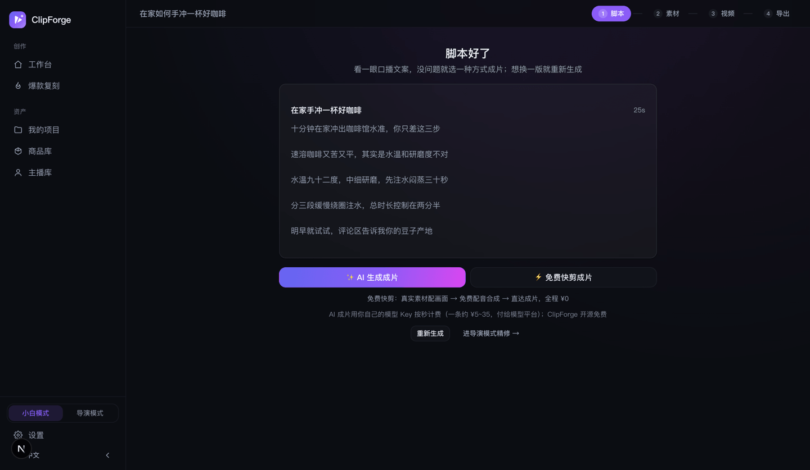
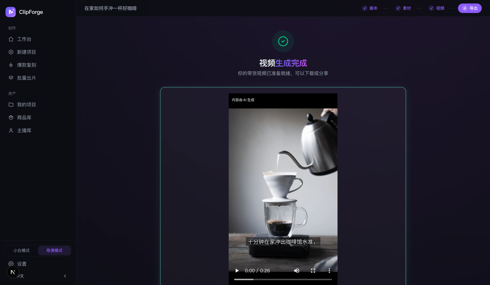
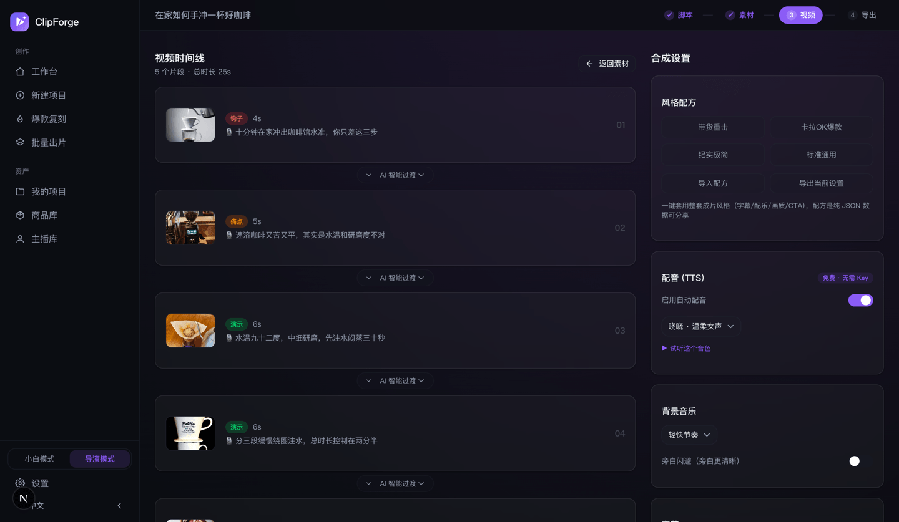

<p align="right"><a href="TUTORIAL.en.md">English</a> · <strong>中文</strong></p>

# ClipForge 使用教程（小白版 · 每一步都写清楚）

> **一句话版**：装好 → 配一个「写脚本」的 Key → 点两下 → 1~3 分钟拿到一条能直接发抖音/小红书的竖屏视频。**全程 0 元也能跑通，成片无水印。**

这篇是给**完全没用过、也不会剪辑**的人写的。每一步都告诉你：**点哪里、会看到什么、出错了怎么办**。
看完还有问题 → [提 Issue](https://github.com/xixihhhh/clipforge/issues) / [Discussions](https://github.com/xixihhhh/clipforge/discussions)，中英文都行。

---

## 目录

1. [先看这张流程图：你要走的路](#1-先看这张流程图你要走的路)
2. [名词速查（30 秒扫一眼，后面就都看得懂）](#2-名词速查30-秒扫一眼后面就都看得懂)
3. [第一步：装上 ClipForge（三选一）](#3-第一步装上-clipforge三选一)
4. [第二步：配一个「写脚本」的 Key（唯一必配项）](#4-第二步配一个写脚本的-key唯一必配项)
5. [第三步：3 分钟出第一条片（免费快剪，¥0）](#5-第三步3-分钟出第一条片免费快剪0-元)
6. [第四步：下载、发布文案、合规标识](#6-第四步下载发布文案合规标识)
7. [进阶一：AI 生成成片（花钱前必读）](#7-进阶一ai-生成成片花钱前必读)
8. [进阶二：导演模式四步工作台逐页说明](#8-进阶二导演模式四步工作台逐页说明)
9. [进阶三：商品库 / 批量 / 爆款复刻 / 日更](#9-进阶三商品库--批量--爆款复刻--日更)
10. [进阶四：让 AI 助手或命令行替你出片](#10-进阶四让-ai-助手或命令行替你出片)
11. [出问题了怎么办（报错对照表）](#11-出问题了怎么办报错对照表)
12. [数据存在哪、怎么备份、怎么卸载](#12-数据存在哪怎么备份怎么卸载)
13. [还是搞不定？这样提问最快被解决](#13-还是搞不定这样提问最快被解决)

---

## 1. 先看这张流程图：你要走的路

```
                 ┌─────────────────────────────────────────┐
  安装 ClipForge │ 桌面版双击 / Docker 一行 / 源码 pnpm dev │
                 └─────────────────────────────────────────┘
                                    ↓
                 ┌─────────────────────────────────────────┐
  配 1 个 Key    │ 只为「写脚本」用，一次约 ¥0.001         │  ← 唯一必配项
                 └─────────────────────────────────────────┘
                                    ↓
       工作台：传商品图 / 贴商品链接 / 说一句话主题
                                    ↓
              选出片方式（这一步决定花不花钱）
                     ╱                        ╲
        🆓 免费快剪                        ✨ AI 生成成片
   真实图库素材 + 免费配音               AI 画面 + AI 口播人物
   全程 ¥0，约 2~3 分钟                  按秒计费，约 4~8 分钟
                     ╲                        ╱
                                    ↓
                 「脚本好了」页：先免费看文案，确认后再出片
                                    ↓
                 成片页：1080p 竖屏无水印 → 下载 + 复制发布文案
```

**记住两句话就够了：**

- **写脚本要 Key，出片可以不要 Key。** 免费快剪的素材、配音、合成全部免费。
- **花钱只有一次点击。** 脚本永远先免费生成，你看完确认，点了「AI 生成成片」才开始计费。

---

## 2. 名词速查（30 秒扫一眼，后面就都看得懂）

| 名词 | 人话解释 |
|---|---|
| **Key / API Key** | 一串密码（形如 `sk-xxxx`），你去 AI 平台注册后拿到，填给 ClipForge 用来调用 AI。**钱是充给那个平台的，ClipForge 不收钱、不经手。** |
| **BYOK** | Bring Your Own Key，自带 Key。ClipForge 开源免费，AI 用量按量付给你自己选的平台，我们不加价不抽成。 |
| **LLM** | 写文字的大模型（DeepSeek、GPT 那类）。这里只用来**写口播脚本**。 |
| **口播 / 旁白** | 视频里"说的话"，也就是配音文案。 |
| **分镜 / 镜头** | 视频被切成的若干小段，每段有一句口播 + 一个画面。 |
| **钩子** | 视频前 3 秒那句抓人的话，决定别人划不划走。 |
| **TTS** | 文字转语音，也就是自动配音。ClipForge 默认用**免费的微软 Edge TTS**，不要 Key。 |
| **免费快剪** | 用免费可商用图库/实拍素材配画面 + 免费配音 + 本机合成，**全程 ¥0**。 |
| **AI 生成成片** | 画面和人物口播都由 AI 模型生成，**按秒付费给模型平台**，质感更好。 |
| **九宫格分镜** | 一次生图把所有镜头画在一张 3×3 大图里，人物/服装/房间/光线天然一致，再裁成每个镜头的画面。 |
| **一键整片** | 把所有镜头画面喂给视频模型，一次生成整条片，镜头间原生切换、台词由人物原声说出。 |
| **判官团** | 四位"毒舌评委"（节奏/口语/创意/结构）在花钱之前先把台词撕一遍并重写。免费。 |
| **小白模式 / 导演模式** | 侧边栏底部一键切换。小白模式只留一条一键出片主路；导演模式解锁分镜、导演台等全部专业工具。 |
| **AIGC 标识** | 国内平台要求 AI 内容打标。ClipForge **默认自动打好**（片头角标 + 文件元数据），不用你操心。 |

---

## 3. 第一步：装上 ClipForge（三选一）

### 3.1 我该选哪个？

| 你的情况 | 选这个 | 难度 |
|---|---|---|
| 我就是想用，不懂技术 | **桌面版**（Windows / macOS / Linux） | ⭐ 双击就行 |
| 我有服务器 / 会用 Docker / 想全家共用一个 | **Docker** | ⭐⭐ 一行命令 |
| 我是开发者，想改代码 | **源码运行** | ⭐⭐⭐ 需要 Node + pnpm + FFmpeg |

> 三种方式功能**完全一样**，数据都存在你自己机器上，不上传任何服务器。

---

### 3.2 方式一：桌面版（最简单，推荐小白）

**① 下载**

打开 👉 **https://github.com/xixihhhh/clipforge/releases/latest**

页面往下拉到 **Assets**（资产）区，按你的系统下载对应文件：

| 系统 | 下载这个文件 | 说明 |
|---|---|---|
| macOS（M1/M2/M3/M4 芯片） | `ClipForge-x.x.x-arm64.dmg` | Apple Silicon 版 |
| Windows 10/11（64 位） | `ClipForge.Setup.x.x.x.exe` | 安装包 |
| Linux（64 位） | `ClipForge-x.x.x.AppImage` | 免安装可执行文件（Linux 包从 v0.8.90 起随版本发布；旧版 Release 里没有，用 Docker 或源码代替） |

> 桌面版**已内置 FFmpeg 和数据库**，不用另外装 Node、不用装 FFmpeg，双击即用。

**② 安装并绕过系统拦截**（这一步几乎人人会遇到，不是病毒，是没买代码签名证书）

<details open>
<summary><b>macOS：双击提示「无法打开，因为无法验证开发者」</b></summary>

1. 双击 `.dmg`，把 ClipForge 拖进「应用程序」文件夹；
2. 打开「应用程序」，**在 ClipForge 图标上点右键 →「打开」**（注意：一定要右键打开，直接双击不行）；
3. 弹窗里再点一次「打开」——**只需要这么做一次**，之后正常双击即可。

如果提示「文件已损坏，无法打开」，在「终端」里执行一次：

```bash
xattr -cr /Applications/ClipForge.app
```

</details>

<details>
<summary><b>Windows：提示「Windows 已保护你的电脑」（SmartScreen）</b></summary>

1. 点弹窗里的 **「更多信息」**；
2. 再点 **「仍要运行」**；
3. 按提示完成安装。

> ⚠️ Windows / Linux 版是自动构建产物、作者未逐版实测，遇到问题欢迎[开 Issue](https://github.com/xixihhhh/clipforge/issues)反馈。

</details>

<details>
<summary><b>Linux：AppImage 双击没反应</b></summary>

先给它可执行权限，再运行：

```bash
chmod +x ClipForge-*.AppImage
./ClipForge-*.AppImage
```

</details>

**③ 打开后你会看到**：一个应用窗口，里面就是工作台（跟网页版长一样）。直接跳到 [第二步](#4-第二步配一个写脚本的-key唯一必配项)。

---

### 3.3 方式二：Docker（一行命令，适合服务器/NAS）

```bash
docker run -d -p 3000:3000 -v clipforge-data:/data ghcr.io/xixihhhh/clipforge:latest
```

然后浏览器打开 **http://localhost:3000**（部署在服务器上就换成服务器 IP）。

逐段解释这行命令，方便你改：

| 片段 | 意思 |
|---|---|
| `-d` | 后台运行 |
| `-p 3000:3000` | 用 3000 端口访问。端口被占了就改左边，如 `-p 8080:3000`，然后访问 `localhost:8080` |
| `-v clipforge-data:/data` | **数据卷，必须加**。项目、商品图、成片都存在这里；不加的话容器一删数据全没 |
| `ghcr.io/xixihhhh/clipforge:latest` | 官方镜像，每次发版自动构建并冒烟测试 |

常用运维命令：

```bash
docker ps                      # 看是否在跑
docker logs -f <容器ID>         # 看日志（启动失败时看这里）
docker stop <容器ID>            # 停止
docker pull ghcr.io/xixihhhh/clipforge:latest   # 升级到最新版（然后 stop 旧容器、用同样命令重新 run，数据卷不动就不会丢数据）
```

> 镜像里已经装好 FFmpeg 和中文字幕字体，**不需要你自己装任何东西**。

---

### 3.4 方式三：源码运行（开发者）

**前置要求**：Node.js ≥ 20（推荐 22）、pnpm、本机 FFmpeg。

```bash
# 1) 装 pnpm（本项目必须用 pnpm，用 npm install 会报错）
corepack enable          # 或者 npm i -g pnpm

# 2) 装 FFmpeg（合成视频要用）
brew install ffmpeg      # macOS
sudo apt install ffmpeg  # Ubuntu / Debian
# Windows：到 https://ffmpeg.org/download.html 下载后把 bin 目录加进 PATH

# 3) 跑起来
git clone https://github.com/xixihhhh/clipforge.git
cd clipforge
pnpm install
pnpm dev
# 打开 http://localhost:3000
```

> ⚠️ **不要用 `npm install`**：pnpm 的 symlink 结构会让 npm 报一堆错。
> 端口 3000 被占用？`PORT=3001 pnpm dev`。

---

### 3.5 装好了吗？两秒自检

- **网页版 / Docker**：浏览器打开 `http://localhost:3000/api/health`，看到一堆 JSON、并且 `"status": "ok"` → 装好了。
- **桌面版**：进入应用 → 右上角/侧边栏 **设置** → 拉到底 **系统诊断 → 查看诊断信息**，能看到版本、数据库、FFmpeg 状态 → 装好了。

> 这两个地方**不含任何密钥**，报障时截图发出来能让人一眼看出问题在哪。

---

## 4. 第二步：配一个「写脚本」的 Key（唯一必配项）

**为什么必须配**：ClipForge 不自带大模型，写口播脚本要调用一个 AI 平台。**这是全流程唯一的必配项**——素材、配音、合成都免费不要 Key。

**要花多少钱**：写一条脚本大约 **¥0.001**（不到一分钱），充 10 块能写几千条。

下面三条路任选一条。

---

### 4.1 路线 A（最省事）：Atlas Cloud 一个 Key 全搞定

一个 Key 同时覆盖**脚本 + 生图 + 生视频 + 配音**，以后想升级到 AI 成片也不用再配第二次。

1. 打开工作台，点 **开始生成**，页面会内联弹出「接入 Atlas Cloud，立即开跑」的卡片（也可以走 **设置 → 顶部「新手推荐 · 一个 Key 全搞定」**）；
2. 点卡片里的 **「没有 Key？1 分钟免费获取」**（也可直接打开注册页 https://www.atlascloud.ai?ref=JPM683 ），注册并复制 API Key；
3. 回到 ClipForge，把 Key 粘进输入框，点 **「连接并开始」**；
4. 看到 **「已接入 Atlas Cloud」** 的绿色提示 = 成功，脚本 / 生图 / 生视频 / 配音的模型已自动帮你选好，不用再逐项设置。

---

### 4.2 路线 B（最便宜）：DeepSeek，手动填三格

1. 打开 https://platform.deepseek.com 注册，充值几块钱，在「API Keys」页面创建一个 Key 并复制（**Key 只显示一次，先存下来**）；
2. ClipForge → **设置 → 「脚本模型」标签页**；
3. 在「快捷预设」里点一下 **DeepSeek** —— baseUrl 和模型名会自动填好；
4. 在 **API Key** 那一格粘贴你刚复制的 Key；
5. 点 **「测试连接」**，看到 **连接成功 ✓** 就完事了（设置**改了即存**，不用点保存）。

---

### 4.3 路线 C（一分钱不花）：本地跑模型 Ollama

适合有点技术、且电脑还行的人，模型跑在自己机器上，**完全免费、断网也能写脚本**。

1. 到 https://ollama.com 下载安装 Ollama；
2. 终端执行 `ollama pull qwen2.5`（下载一个中文还不错的模型）；
3. ClipForge → 设置 → 脚本模型 → 快捷预设点 **「Ollama 本地」**；
4. 模型名要写全（含 tag），比如 `qwen2.5:7b-instruct`；不确定就点 **「读取可用模型」** 看本机装了哪些；
5. 点「测试连接」→ 成功即可。

---

### 4.4 其它平台预设（点一下自动填 baseUrl 和模型）

设置 → 脚本模型 → 快捷预设里内置了这些，点一下只需再补 Key：

| 预设 | baseUrl | 默认模型 | 备注 |
|---|---|---|---|
| Atlas Cloud | `https://api.atlascloud.ai/v1` | `deepseek-ai/deepseek-v4-pro` | 推荐，一个 Key 全流程通用 |
| OpenRouter | `https://openrouter.ai/api/v1` | `openai/gpt-4o` | 一个 Key 聚合 400+ 模型 |
| DeepSeek | `https://api.deepseek.com` | `deepseek-v4-flash` | 便宜 |
| Kimi | `https://api.moonshot.cn/v1` | `kimi-k2.5` | |
| 智谱 GLM | `https://open.bigmodel.cn/api/paas/v4` | `glm-5-turbo` | |
| MiniMax | `https://api.minimax.chat/v1` | `MiniMax-M2.7` | |
| 豆包（火山方舟） | `https://ark.cn-beijing.volces.com/api/v3` | `doubao-seed-2-0-pro-260215` | |
| OpenAI | `https://api.openai.com/v1` | `gpt-5.4` | |
| Ollama 本地 | `http://127.0.0.1:11434/v1` | `qwen2.5` | 免费离线 |

> 任何兼容 OpenAI 协议的平台都能用：自己填 baseUrl + Key + 模型名即可，也支持自定义模型 ID。

### 4.5 「测试连接」失败了？

| 提示 | 多半是 | 怎么修 |
|---|---|---|
| 连接失败 ✗ / 401 | Key 填错、复制时带了空格 | 重新复制粘贴，注意首尾空格 |
| 402 / 余额不足 | 平台没钱了 | 去平台充值 |
| 404 / 模型不存在 | 模型名写错 | 点「读取可用模型」从列表里选 |
| 404（Atlas Cloud） | baseUrl 填成了素材网关 `…/api/v1` | 脚本模型这一栏要填 `https://api.atlascloud.ai/v1`（`/api/v1` 只服务生图/生视频/配音）；v0.8.94 起旧配置会自动改回来 |
| 超时 | 网络到不了该平台 | 换平台，或在「自定义接入点 baseUrl」里填你的代理地址 |

> 连接测试走的是**服务端**，不受浏览器跨域限制；失败基本都是 baseUrl / Key / 模型名三者之一写错。

---

## 5. 第三步：3 分钟出第一条片（免费快剪，0 元）


### 屏幕 1：工作台（进来第一眼）

**你要做的只有三行：**

**① 把东西丢进来** —— 顶部三个标签任选一个：

| 标签 | 什么时候用 | 怎么填 |
|---|---|---|
| **上传商品图** | 你手上有商品照片 | 拖进去或点击上传，最多 5 张；下面再填「商品名称」（必填）和「核心卖点」（选填，填了脚本更准） |
| **商品链接** | 你有淘宝/京东/拼多多/1688/独立站链接 | 粘进去即可，自动抓标题、价格、主图 |
| **一句话成片** | 没有商品，只想做个话题视频 | 直接说主题，例如「3 个让租房变高级的小物」 |

> **完全没素材？** 输入区下面有 **「没素材，先试试」** 的示例商品，点一个直接跑通全流程。

**② 选出片方式** —— 第一次就保持默认的 **🆓 免费快剪**（真实素材混剪 + 免费配音，全程 ¥0，约 2 分钟）。
右边那个 **✨ AI 生成成片** 是花钱的，先别点，[第 7 节](#7-进阶一ai-生成成片花钱前必读)专门讲它。

**③ 点「开始生成」** —— 就这样，没有第四步。

> 还看到别的模块？**🔥 今天发什么** 是实时热搜选题（点一条直接写成视频），**📅 日更 · 按人设选题** 是按关键词自动挑今日选题，**继续未完成的项目** 是你的历史项目。第一次用可以先不管。

---

### 屏幕 2：进度卡（点完之后）

整张卡会变成一个进度清单，依次亮：**创建项目 → 上传商品图 → AI 写脚本**。
通常 20~60 秒。**别关页面**，写完脚本会自动跳到下一步。

---

### 屏幕 3：「脚本好了」



这一页是**零成本确认闸门**：脚本已经免费写好了，你先看一眼口播文案。

- 觉得不行 → 点 **「重新生成」** 换一版（还是免费）；
- 觉得可以 → 点 **「免费快剪成片」**（¥0）；
- 想要 AI 画面 → 点 **「AI 生成成片」**（这里开始才花钱，见[第 7 节](#7-进阶一ai-生成成片花钱前必读)）；
- 想自己精修每个镜头 → 点 **「进导演模式精修 →」**（见[第 8 节](#8-进阶二导演模式四步工作台逐页说明)）。

点了免费快剪后它会自动跑：**判官团过台词（自动重写弱句，不花钱）→ 配画面（免费素材，优先实拍视频、配不到退图片）→ 免费配音 + 字幕 → 本机合成**。通常 1~3 分钟。

---

### 屏幕 4：成片页

看到视频能播 = **你的第一条片出来了** 🎉 直接进[第 6 节](#6-第四步下载发布文案合规标识)下载。

---

## 6. 第四步：下载、发布文案、合规标识



导出页上你会用到的东西：

| 模块 | 干嘛的 |
|---|---|
| **下载视频** | 1080p 竖屏、**无水印** MP4，直接发平台 |
| **历史成片** | 这个项目合成过的所有版本，可以逐条对比挑最好的 |
| **发布文案** | 点「AI 生成标题/话题」，一次给你**吸睛标题 + #话题标签 + 种草文案**，点一下就复制 |
| **带追踪的商品链接** | 带 UTM 参数的商品链接，用来看这条视频到底带来多少点击 |
| **评论区运营包** | 置顶自问自答 + 高频异议回复模板（评论区是视频的第二落地页） |
| **AI 内容声明** | 一键复制的「AI 生成」声明句，发布时贴进简介里 |
| **更多产出** | 封面图、小红书图文卡片、商品扫码购买二维码、片尾扫码成片 |

**关于合规（国内发布很重要，但你不用做什么）：**

- 成片**默认已烧录**片头「内容由 AI 生成」角标（左上角 ≥2 秒），并**自动写入隐式文件元数据**（对齐国标 GB 45438-2025）；
- 脚本页有**广告法违禁词扫描**，鼠标悬停就能看到替换建议；
- 还有**发布前自检**：风险词、钩子、时长、字幕、CTA 逐项检查并给改法。

> 按平台规则**标识**的 AI 内容是被允许的；**刻意去掉标识**才是高风险行为——所以别关那个角标。

---

## 7. 进阶一：AI 生成成片（花钱前必读）

免费快剪用的是图库真实素材；想要**商品出镜、AI 素人真人口播、剧情短剧**这种质感，就走 AI 档。

### 7.1 先说钱：一条多少

**ClipForge 本身永远免费开源**，AI 用量按秒**直接付给你自己选的模型平台**，我们不加价、不抽成、不经手。

一键整片是**按秒**计费的，单价随模型差很多（Atlas 官方基准价，2026-09 核对）：

| 一键整片模型 | 基准价 | 时长上限 | 30 秒 @720p | 30 秒 @1080p |
|---|---|---|---|---|
| Seedance 2.5（当前默认） | $0.134/秒 | 30 秒 | 约 $8 | 约 $18 |
| **Wan 3.0**（最划算） | $0.04/秒 | 30 秒 | **约 $2.4** | 约 $5.4 |
| Wan 3.0 Prime | $0.061/秒 | 30 秒 | 约 $3.7 | 约 $8.2 |
| MiniMax H3 | $0.038/秒 | 15 秒 | 15 秒约 $1.1 | 15 秒约 $2.6 |

> **分辨率是最大的花钱开关。** 平台公布的「基准价」对应最低档（480p）。实测（2026-09，5 秒竖屏）：
>
> | 短边 | 实际倍率 |
> |---|---|
> | 480p | 1x（基准价） |
> | 720p | **2x** |
> | 1080p | **约 4.5x** |
>
> 所以同一条 30 秒的片，从 720p 调到 1080p，钱翻一倍多。ClipForge 默认用 **720p**——竖屏短视频发到平台还会被再压一次，1080p 多花的钱基本看不出来。另外原生 `1080p` 和 `1080p-sr`/`-esr` 超分档是**不同产品**，超分更贵。以上为参考，最终以你的账单为准。

九宫格分镜（一次生图画齐所有镜头）另计，约 ¥1.3。

**想省钱？换个模型就行**（设置 → 视频模型，默认是 Seedance 2.5，画质与原生人声最好，但也最贵）：

| 想要什么 | 换成 | 基准价 | 说明 |
|---|---|---|---|
| 一键整片，省一大半 | **Wan 3.0** | $0.04/秒 | 比默认省 3.3 倍，同样支持满 30 秒，原生 1080p，带音轨同价 |
| 一键整片，最省 | **Seedance 2.0 Mini** / **H3-Developer** | $0.011 / $0.02 | 跑量试片用，画质让位于成本 |
| 逐镜生成（i2v） | **MiniMax H3 Max** | $0.048/秒 | 便宜且稳，5-15 秒，原生最高 768P；**没有参考生视频，一键整片用不了** |
| 只要 15 秒内的短片 | **MiniMax H3** | $0.038/秒 | 单价低，2K，但单次上限 15 秒 |

> 建议的省钱顺序：**先把分辨率从 1080p 调到 720p**（省一半以上，发到平台基本看不出差别），**再考虑换模型**。两个都做，一条 30 秒的片能从 $18 降到 $2.4。

### 7.2 要多配什么

免费档只要 LLM Key；AI 档还要**生图模型**和**视频模型**：

- 用 Atlas Cloud 的话：一个 Key 已经全配好了，**什么都不用做**；
- 用别的平台：**设置 → 「平台 Key」**填对应平台 Key → **「生图模型」**和**「视频模型」**标签页里各选一个默认模型（模型列表运行时自动拉取，填好 Key 就会出现）。

如果没配好，点 AI 成片时会直接提示「还没配好生图/视频模型」，不会白跑。

### 7.3 完整操作步骤

1. 工作台输入商品 → 出片方式选 **✨ AI 生成成片**；
2. 选 **带货形式**（这一档才会出现）：

   | 形式 | 适合 |
   |---|---|
   | **智能推荐**（默认） | 不知道选啥就用它，AI 按商品挑风格，以实物展示为主 |
   | **真人口播** | AI 素人对镜口播种草，内置真实感规则，不出"一眼假"网红脸 |
   | **情景短剧** | 有人物有剧情的种草小短剧，多角色各配专属音色 |
   | **图文混剪** | 节奏卡点的图文快剪 |

3. 选了真人口播/情景短剧，可以再指定 **出镜主播**（默认「智能素人」）；
4. 点 **开始生成** → 脚本免费写好 → 停在「脚本好了」页；
5. **看完文案确认没问题**，点 **「AI 生成成片」**——**这一次点击才开始计费**；
6. 自动跑：生成主播四视图定妆照（如需）→ 九宫格分镜（一次画齐所有镜头，锁人锁品）→ 一键整片（原生切镜 + 人物原声台词）→ 成片页。约 3~6 分钟，**别关页面**。

### 7.4 想让每条视频都是"同一个人"（锁脸）

1. 侧边栏 → **主播库**（或设置 → 「出镜人物」）→ 添加人物：填名称、简短描述、**外貌特征（英文，越具体越一致）**、声音风格；
2. 点 **「✨ 多视图定妆」**——一次生成**正面/侧面/背面/特写四视图定妆照**（同一次生成保证是同一个人）；
3. 之后在素材页选中这位主播，**九宫格和一键整片都会拿定妆照当身份锚**——跨镜头、跨条视频都不换脸。

### 7.5 生成失败会不会白扣费？

不会。

- **免费链路**：随便重试，不花钱；
- **AI 链路**：采用两阶段任务表，**已提交的云端任务可以在素材页恢复领取**，不会重复扣费；
- 任何一步失败，都可以转导演模式手动逐步完成，或退回免费快剪出片。

---

## 8. 进阶二：导演模式四步工作台逐页说明

**怎么切换**：侧边栏底部 **小白模式 ⇄ 导演模式**。
小白模式只留一键出片主路；导演模式解锁全部专业工具。项目顶部会出现四步进度条：**脚本 → 素材 → 视频 → 导出**。

### 8.1 脚本页

- **分镜时间线**：每个镜头一行，带类型标签（钩子/痛点/产品/演示/背书/转化）；点某行的「编辑」可以改**口播文案**和**画面描述**；
- **脚本方案**：AI 一次给多套方案，选你喜欢的；满意的可以 **「存为模板」**下次直接套用；
- **判官团**：四位毒舌判官（节奏/口语/创意/结构）撕台词并给重写，点 **「应用重写」**一键替换——**审词不花生成费**；
- **广告法合规提醒**：风险词标红，悬停看替换建议；
- **发布前自检**：给出「可发布 / 有风险 / 建议先改」结论；
- 底部 **「下一步：生成素材」**。

### 8.2 素材页



| 按钮 | 作用 | 花钱？ |
|---|---|---|
| **自动配画面** | 从免费素材库按分镜检索词自动配画面 | ❌ 免费、免 Key |
| **上传图片 / 换一张** | 用你自己的图 | ❌ |
| **🎬 九宫格分镜** | 一次生图画齐全部镜头（≤9 镜），人物场景光线天然一致 | ✅ 生图费 |
| **🎞️ 一键整片** | 全部关键帧喂给视频模型，一次出整片（脚本 ≤30 秒） | ✅ 视频费 |
| **一键全部生成** | 逐镜生成素材 | ✅ |
| **商品保真** 开关 | 展示商品的镜头用你的商品图重绘，避免 AI 把商品画变形 | — |
| **AI 动态镜头** 开关 | 出图后自动图生视频转成真动态镜头（更好但更贵；关掉只出静图） | ✅ |
| **出镜主播** | 选主播库里的人，已定妆的会锁脸 | — |
| **实拍占比** | 显示实拍/上传素材的时长占比，**≥50% 可吃抖音混合内容流量倾斜** | — |

### 8.3 视频页（合成设置）

| 分区 | 能调什么 |
|---|---|
| **配音 (TTS)** | 开关自动配音；免费音色有晓晓/晓伊/云希/云扬/云健，点 **▶ 试听这个音色**；配了付费 TTS 会优先用付费的 |
| **背景音乐** | 轻快/舒缓/动感/情感四种情绪，或上传自己的 mp3；**旁白闪避**让人声更清楚 |
| **人声落地** | 加房间底噪、去播音腔，更像实拍（默认开） |
| **字幕** | 位置（底/中/顶）+ 四种样式：标准底板 / 重击大字（高留存爆款风）/ 极简 / 卡拉OK逐字 |
| **带货转化** | 片尾购买 CTA 文案、商品卡贴片 |
| **画面设置** | 比例（9:16 竖屏 / 16:9 / 1:1）、分辨率、渲染质量（快速 720p / 标准 1080p / 高清 1080p 最佳） |
| **风格配方** | 把整套风格（字幕/配乐/画质/CTA）导出成 JSON 分享给别人，或导入别人的 |
| **变体矩阵** | 同一套素材，**钩子 × 字幕样式 × 配乐情绪**交叉批量出多条做 A/B——**只重跑合成，不重新生成 AI 素材、不产生生成费** |

调完点 **「开始合成」**，进度跑到 100% 后点 **「下一步：导出视频」**。

### 8.4 导出页

见[第 6 节](#6-第四步下载发布文案合规标识)，导演模式和小白模式的导出页是同一个。

---

## 9. 进阶三：商品库 / 批量 / 爆款复刻 / 日更

| 功能 | 在哪 | 怎么用 |
|---|---|---|
| **商品库** | 侧边栏 → 商品库 | 把常卖的商品存起来，下次建项目直接选，不用重复上传 |
| **批量出片** | 侧边栏 → 批量出片（导演模式） | 勾选多个商品 + 统一配置（视频模式/脚本风格/品类）→ 一键排队逐条产出，大促前一晚跑十条 |
| **爆款复刻** | 侧边栏 → 爆款复刻 | 粘贴抖音/快手/小红书爆款视频链接 → 载入高转化结构 → 上传你的商品 → 用同结构重新生成。⚠️ 注意素材授权，风险自担 |
| **今天发什么** | 工作台热榜区 | 实时抖音/头条热搜（已过滤时政），点一条直接写成视频；每条带「同款」直达复刻 |
| **日更 · 按人设选题** | 工作台 | 填人设关键词（如"美妆 护肤 好物"）→ 点「出今日一条」自动选题 → 点「开始生成」 |

---

## 10. 进阶四：让 AI 助手或命令行替你出片

> 这一节偏技术向，不感兴趣可以直接跳到[第 11 节](#11-出问题了怎么办报错对照表)。

### 10.1 命令行 CLI

**前提**：先跑起一个 ClipForge 实例（`pnpm dev` / `pnpm start` / Docker 都行）。

设置环境变量（写脚本要用）：

```bash
# macOS / Linux
export CLIPFORGE_BASE_URL="http://localhost:3000"
export CLIPFORGE_LLM_BASE_URL="https://api.atlascloud.ai/v1"
export CLIPFORGE_LLM_API_KEY="sk-你的key"
export CLIPFORGE_LLM_MODEL="deepseek-ai/deepseek-v4-pro"
```

```powershell
# Windows PowerShell
$env:CLIPFORGE_BASE_URL="http://localhost:3000"
$env:CLIPFORGE_LLM_BASE_URL="https://api.atlascloud.ai/v1"
$env:CLIPFORGE_LLM_API_KEY="sk-你的key"
$env:CLIPFORGE_LLM_MODEL="deepseek-ai/deepseek-v4-pro"
```

常用命令：

```bash
node bin/clipforge.mjs trends                                          # 拉热搜选题
node bin/clipforge.mjs create --topic "在家手冲咖啡" --quality hd --bgm  # 一句话出片，最后打印 videoUrl
node bin/clipforge.mjs list                                            # 列出项目
node bin/clipforge.mjs get --project <id>                              # 查最新成片地址
node bin/clipforge.mjs qc --project <id>                               # 成片质检（黑屏/静音/响度）
node bin/clipforge.mjs gate --project <id> --strict                    # 发布门禁，拦截时退出码 2
node bin/clipforge.mjs transcript --project <id> --media <mediaId>     # 检查原片逐词稿和剪辑版本
node bin/clipforge.mjs transcript-edit --project <id> --media <mediaId> --plan edit.json --revision 0 --operation edit-001  # 先预演，确认后加 --apply
node bin/clipforge.mjs timeline --project <id> --media <mediaId> --plan edit.json --format otio --out edit.otio  # 导出可编辑专业时间线
node bin/clipforge.mjs --help                                          # 全部命令
```

### 10.2 全自动日更（cron）

```bash
crontab -e
# 每天 9 点从热榜拿榜一，自动出一条待发成片（路径和环境变量换成你自己的）
# 0 9 * * * cd /path/to/clipforge && TOPIC=$(node bin/clipforge.mjs trends --json | python3 -c "import json,sys;print(json.load(sys.stdin)['topics'][0]['title'])") && node bin/clipforge.mjs create --topic "$TOPIC" --bgm >> daily.log 2>&1
```

> 出的是**待发草稿**（本地视频文件）。**发布动作留给你自己做**——自动发布有账号风控和平台协议风险，我们不做。

### 10.3 接进 Claude Desktop / Cursor（MCP）

在 MCP 配置里加上（Claude Desktop：`claude_desktop_config.json`；Cursor：`~/.cursor/mcp.json`）：

```json
{
  "mcpServers": {
    "clipforge": {
      "command": "node",
      "args": ["/绝对路径/clipforge/mcp/clipforge-mcp.mjs"],
      "env": {
        "CLIPFORGE_BASE_URL": "http://localhost:3000",
        "CLIPFORGE_LLM_BASE_URL": "https://api.atlascloud.ai/v1",
        "CLIPFORGE_LLM_API_KEY": "sk-...",
        "CLIPFORGE_LLM_MODEL": "deepseek-ai/deepseek-v4-pro"
      }
    }
  }
}
```

Claude Code 用户一条命令：

```bash
claude mcp add clipforge -- node /绝对路径/clipforge/mcp/clipforge-mcp.mjs
```

配好之后，直接对 AI 说「用 ClipForge 给这个商品链接做一条竖屏带货视频」即可。完整工具清单见 [mcp/README.md](mcp/README.md)。

---

## 11. 出问题了怎么办（报错对照表）

### 11.1 安装 / 启动类

| 症状 | 原因 | 解法 |
|---|---|---|
| macOS「无法验证开发者」/「已损坏」 | 应用未做代码签名 | 右键 →「打开」；或终端 `xattr -cr /Applications/ClipForge.app` |
| Windows「已保护你的电脑」 | SmartScreen | 「更多信息」→「仍要运行」 |
| Linux AppImage 双击没反应 | 缺可执行权限 | `chmod +x ClipForge-*.AppImage` |
| `pnpm install` 之前用了 `npm install` 报一堆错 | 本项目必须用 pnpm | 删掉 `node_modules` 后 `pnpm install` |
| 启动报 better-sqlite3 相关错误 | 原生模块和当前 Node/Electron ABI 不匹配 | 源码：重新 `pnpm install`；Electron 开发：`pnpm electron:rebuild` |
| 打开 localhost:3000 打不开 | 端口被占 / 服务没起来 | 换端口 `PORT=3001 pnpm dev`；Docker 看 `docker logs` |

### 11.2 Key / 模型类

| 症状 | 原因 | 解法 |
|---|---|---|
| 「尚未配置 LLM，请先到设置填写 API Key」 | 没配写脚本的 Key | 见[第 4 节](#4-第二步配一个写脚本的-key唯一必配项) |
| 「脚本生成失败，请检查 LLM 配置」 | Key 错 / 没余额 / 模型名错 | 设置 → 脚本模型 → 点「测试连接」看具体报错 |
| 「未配置默认生图模型」 | AI 档缺生图模型 | 设置 →「生图模型」选一个默认模型 |
| 「还没配好生图/视频模型」 | AI 成片缺模型 | 设置 →「生图模型」+「视频模型」各选一个（或直接接 Atlas 一个 Key） |
| 模型下拉框是空的 | 该平台 Key 没填或无效 | 先在「平台 Key」里填好 Key，模型列表会自动出现 |

### 11.3 生成 / 成片类

| 症状 | 原因 | 解法 |
|---|---|---|
| 「没能从该链接抓取到商品信息」 | 该站点反爬或结构特殊 | 改用「上传商品图」手动建项目 |
| 卡在"生成中"很久 | AI 平台排队/网络慢 | AI 整片本来就要 3~6 分钟；超过 10 分钟去素材页看看能不能恢复领取任务 |
| 自动成片失败 | 中间某步失败 | 点「转手动编辑」进导演模式逐步完成；或退回免费快剪 |
| 成片没有声音 | TTS 被关了 | 视频页 →「配音 (TTS)」→ 打开「启用自动配音」 |
| 字幕是方块/乱码 | 系统缺中文字体（自建环境） | 用官方 Docker 镜像（已内置中文字幕字体），或给系统装中文字体 |
| 合成直接失败、日志提到 drawtext | FFmpeg 构建缺 drawtext 滤镜 | 用系统包管理器装的 FFmpeg（`brew install ffmpeg` / `apt install ffmpeg`），别用缺 harfbuzz 的静态构建 |
| 九宫格提示"需要 2–9 个分镜" | 镜头数超范围 | 缩短脚本，或改用逐镜生成 |

### 11.4 Docker 类

| 症状 | 原因 | 解法 |
|---|---|---|
| 重启容器后项目全没了 | 没挂数据卷 | 一定要带 `-v clipforge-data:/data` |
| 升级后数据还在吗？ | 数据在卷里，不在容器里 | `docker pull` 新镜像 → 停旧容器 → 用**同样的 `-v`** 重新 run，数据不动 |
| 端口冲突 | 3000 被占 | `-p 8080:3000`，访问 `localhost:8080` |

---

## 12. 数据存在哪、怎么备份、怎么卸载

**你的项目、商品图、成片全部在本机，不上传任何服务器。** 位置：

| 安装方式 | 数据目录 |
|---|---|
| macOS 桌面版 | `~/Library/Application Support/ClipForge/data` |
| Windows 桌面版 | `%APPDATA%\ClipForge\data` |
| Linux 桌面版 | `~/.config/ClipForge/data` |
| 源码运行 | 项目目录下的 `data/` |
| Docker | 数据卷 `clipforge-data`（容器内 `/data`） |

目录里有什么：`sqlite.db`（项目数据库）、`uploads/`（你上传的图）、`output/`（合成好的视频）。

- **备份 / 换电脑**：整个 `data` 目录复制走，粘到新机器同样位置即可。
- **卸载**：桌面版直接删应用（想彻底清干净就再删上面的数据目录）；Docker `docker rm` 容器 + `docker volume rm clipforge-data`。
- **Key 存哪**：存在本地设置里，不会随项目文件外发；诊断信息和日志里**不含任何密钥**。

---

## 13. 还是搞不定？这样提问最快被解决

去 [Issues](https://github.com/xixihhhh/clipforge/issues) 或 [Discussions](https://github.com/xixihhhh/clipforge/discussions)（**中英文都可以**），带上这三样，基本一轮就能定位：

1. **诊断信息**：设置 → 拉到底 → 系统诊断 → 「查看诊断信息」→「复制」；网页/Docker 也可以直接贴 `http://localhost:3000/api/health` 的内容（**不含密钥，可以放心贴**）；
2. **你做了什么**：哪个页面、点了哪个按钮、卡在第几步；
3. **报错原文或截图**。

其它文档入口：

- 📘 [官网使用手册](https://xixihhhh.github.io/clipforge/guide.html)（网页版，同内容速览）
- ❓ [FAQ 大全](https://xixihhhh.github.io/clipforge/faq.html)
- 🧰 [MCP 工具清单](mcp/README.md) · [Agent Skill](skills/clipforge-video/SKILL.md)
- 📄 [README](README.md)（功能全景、技术架构、Roadmap）

> 请遵守各平台广告与 AIGC 标识规则，对你发布的内容负责。
