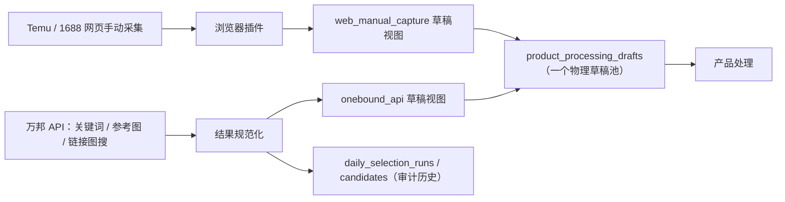

# 数据采集模块（后端 / 数据库交接版）

本目录提供宿主无关的数据采集后端：1688 关键词/参考图/相似链接采集、Temu/1688 网页浏览器插件采集、候选规范化与评分、批次快照、反馈和受控图片读取。模块不创建前端页面；采集结果统一进入产品处理模块拥有的一个物理草稿池 `product_processing_drafts`，并按来源提供两个草稿视图。

本文档用于后端和数据库同事接手。当前默认实现使用 SQLite，业务边界与表结构可原样迁移到项目的正式数据库；不要把 Demo 的整套工作台用户、订单、商品草稿或插件表直接并入本模块。

## 当前项目进度（2026-08-05）

- 已完成 1688 关键词采集、1688 商品链接相似采集，以及 OneBound 图搜的完整链路：安全下载参考图、`upload_img`、`item_search_img`、候选规范化和 1688 商品详情链接生成。
- 图片下载已具备公网 IP 固定连接、重定向限制、5 MiB 上限、MIME 与文件魔数校验；当本机 DNS 返回失败或非公网地址时，会通过固定 TLS 校验的 DoH 回退解析。对于 CDN 明确要求的 `format/avif` 转码，会受控改为 JPEG 后再执行同样校验与上传。
- 已完成 Temu 浏览器插件命令队列、会话隔离、结果回传和脱敏入库接口；浏览器插件源码随本分支发布，负责读取已登录页面并回传商品结构化数据。
- 已完成 SQLite 采集批次、候选、反馈、handoff、调用预算和插件队列表的迁移与接线。万邦 API 采集成功后立即写入产品处理草稿；确认操作只消费已入库的草稿，不会再创建第二份草稿。前端框架与正式数据库适配由各自模块继续对接；本分支只发布采集后端、浏览器插件和本 README，不包含 Demo、测试或规划文档。

## 草稿池与采集数据流

每日选品只有一个物理草稿池：产品处理模块的 `product_processing_drafts`。它不是三套独立的候选池；前端只是按 `source_type` 过滤成“网页手动采集”和“API 采集”两个来源视图。

| 来源 | 草稿来源类型 | 入库时机 |
| --- | --- | --- |
| Temu / 1688 网页手动采集 | `web_manual_capture` | 插件采集成功后 |
| 万邦 API（关键词 / 参考图 / 1688 链接图搜） | `onebound_api` | API 采集结果返回后 |

万邦 API 的预览候选会保留在 `daily_selection_runs` / `daily_selection_candidates` 中，用于批次审计、回看和反馈；它们不是另一套等待确认的“候选池”。同一候选在 API 结果返回时已幂等写入 `onebound_api` 草稿，后续确认只关联或消费这份既有草稿，不得再创建重复草稿。

| 方向 | 调用入口 | 数据来源 | 草稿入口与审计结果 |
| --- | --- | --- | --- |
| Temu 网页手动采集 | `POST /desktop/data-collection/temu-link/collect` | 已登录 Temu 的浏览器插件 | 插件成功回传后写入 `web_manual_capture` 草稿；命令会话和结果仍写入插件队列表 |
| 1688 网页手动采集 | 浏览器插件当前页采集命令 | 已登录 1688 的浏览器插件 | 插件成功回传后写入 `web_manual_capture` 草稿 |
| 1688 关键词 / 参考图 / 相似链接 | `POST /desktop/daily-selection/preview` 或 `POST /desktop/daily-selection/preview-from-1688-link` | OneBound：关键词搜索、`upload_img` → `item_search_img`、`item_get` | 结果立即幂等写入 `onebound_api` 草稿；`daily_selection_runs`、`daily_selection_candidates` 仅保存该次采集的审计快照 |



## 安全配置与宿主接线

密钥由宿主的安全设置模块管理。推荐由部署环境向宿主提供下列环境变量，再由 `provider_config_resolver` 转成 `OneBound1688Provider` 的配置映射；每日选品模块本身不直接读取环境变量：

| 环境变量 | Provider 配置键 | 说明 |
| --- | --- | --- |
| `DAILY_SELECTION_ONEBOUND_API_KEY` | `api_key` | 必填，只在进程内注入 |
| `DAILY_SELECTION_ONEBOUND_API_SECRET` | `api_secret` | 必填，只在进程内注入 |
| `DAILY_SELECTION_ONEBOUND_BASE_URL` | `base_url` | 必填 HTTP(S) API 根地址，生产必须使用 HTTPS；不得含 userinfo、query、fragment 或密钥 |
| `DAILY_SELECTION_ONEBOUND_ENABLED` | `enabled` | 可选布尔值，默认启用 |

不要把真实密钥写入本 README、源码、测试、fixture、SQLite、日志、错误信息或版本控制文件，也不要用 `.env` 文件提交密钥。Provider 的 `safe_summary()` 不返回密钥；审计、候选原始载荷、批次 criteria/metadata 会过滤或脱敏敏感字段。生产宿主应从密钥库或受保护的进程环境读取凭据，并通过 `DailySelectionRouteDependencies.provider_config_resolver` 按当前 actor/workspace 解析配置。

宿主创建 `APIRouter`，注入 actor/workspace 解析器、Provider 配置解析器、Provider factory 和 SQLite 路径，然后调用：

```python
register_daily_selection_routes(router, dependencies)
```

`DailySelectionRouteDependencies` 也支持注入已有 repository、预算实现、图片缓存和 run ID factory。模块不会 import 宿主 `app.py`。

## 路由

所有路由均要求宿主提供已认证的 `DailySelectionActor(actor_id, workspace_id)`，批次读写按 workspace 隔离。

| 方法 | 路径 | 用途 |
| --- | --- | --- |
| `POST` | `/desktop/daily-selection/preview` | 校验条件，采集、筛选、评分并保存批次快照 |
| `POST` | `/desktop/daily-selection/preview-from-1688-link` | 输入 `source_url`，先调用 `item_get`，再以主图优先、标题兜底执行 1688 相似商品采集 |
| `GET` | `/desktop/daily-selection/runs?limit=20&offset=0` | 分页列出当前 workspace 的批次摘要（`limit` 最大 100） |
| `GET` | `/desktop/daily-selection/runs/{run_id}` | 回读完整批次与候选快照 |
| `POST` | `/desktop/daily-selection/runs/{run_id}/feedback` | 保存反馈并把候选标记为 rejected |
| `POST` | `/desktop/daily-selection/runs/{run_id}/confirm` | 仅确认无风险候选；幂等关联/消费该候选已入库的 `onebound_api` 草稿，不会创建新草稿 |
| `GET` | `/desktop/daily-selection/image?run_id=...&url=...` | 通过宿主注入的安全图片缓存读取已记录 URL；本地运行时默认已接线 |
| `POST` | `/desktop/data-collection/plugin-sessions` | 为当前 workspace 建立浏览器插件会话，返回会话 token |
| `POST` | `/desktop/data-collection/temu-link/collect` | 使用 `session_id` 和 Temu 商品链接创建 `temu_link_capture` 命令 |
| `GET` | `/desktop/data-collection/plugin/poll` | 插件以 `session_token` 领取待执行命令 |
| `POST` | `/desktop/data-collection/plugin/results` | 插件回传 `running`、`succeeded` 或 `failed` 结果 |
| `GET` | `/desktop/data-collection/plugin-commands/{command_id}` | 当前 workspace 查询命令及回传结果 |

Temu 链接不会交给 OneBound：它只允许受控浏览器插件在已登录 Temu 页面执行。插件需要识别 `temu_link_capture`，从 payload 的 `source_url` 打开/读取商品详情后，向结果接口回传脱敏的 JSON 数据。当前服务端已实现和原 Demo 一致的 `queued → sent → running → succeeded/failed` 数据流；待拿到插件源码后只需对接这一条命令，不需要迁移 Demo 的用户、权限或其它业务模块。

## 后端与数据库接手范围

后端同事需要保留以下边界：

- API 层只解析当前登录态为 `DailySelectionActor(actor_id, workspace_id)`；所有读取和写入必须带 `workspace_id` 条件。
- 1688 凭据仅由宿主的密钥管理或环境注入；数据库、命令 payload、审计日志和 API 响应不得保存 `api_key`、`api_secret`、Cookie、token。
- Temu 插件仅能领取其自身 `session_token` 对应的命令；创建/查询命令必须同时校验 `actor_id + workspace_id`。
- `result_json` 是插件原始脱敏回传；采集成功后由受控入库逻辑规范化为 `web_manual_capture` 草稿。不能让插件或调用方直接修改草稿表。
- `daily_selection_handoffs` 保留确认审计和幂等关联职责；它不是创建 API 草稿的前置条件。API 草稿在结果返回时已入库，确认仅按 `idempotency_key` 安全消费既有草稿。

### 正式数据库替换清单

当前 SQLite 访问集中在三个类，替换为 MySQL/PostgreSQL/项目统一 ORM 时应保持同名业务方法和事务语义：

| 当前实现 | 责任 | 正式数据库替换要求 |
| --- | --- | --- |
| `DailySelectionRepository` | 批次、候选、反馈、handoff | 所有更新使用同一事务；`workspace_id + run_id` 为读写隔离条件；确认 handoff 保留唯一幂等约束 |
| `SQLiteDailyApiBudget` | 每 workspace/凭据指纹/日期的调用预算 | 用原子 `INSERT ... ON CONFLICT/ON DUPLICATE KEY UPDATE` 或行锁实现 reserve/release，不能先读后写 |
| `DataCollectionPluginQueue` | Temu 插件会话、命令入队、领取、回传 | 领取命令必须原子变更 `queued → sent`；可使用 `FOR UPDATE SKIP LOCKED` 或等价的 CAS 更新 |

推荐把 SQLite 的时间文本改为正式库的 `TIMESTAMP WITH TIME ZONE`（或统一 UTC 时间戳），JSON 文本改为 `JSON/JSONB`。迁移时保留 JSON 字段名称，避免改动插件和前端契约。

### 表、主键和约束

| 表 | 主键 / 唯一约束 | 必须保留的索引或约束 | 数据库负责人 |
| --- | --- | --- | --- |
| `daily_selection_runs` | `(workspace_id, run_id)` | `(workspace_id, created_at DESC, run_id)` | 采集模块 |
| `daily_selection_candidates` | `(workspace_id, run_id, candidate_id)` | FK 到 runs，按 workspace/run 查询索引 | 采集模块 |
| `daily_selection_feedback` | `feedback_id` | FK 到候选；按 workspace/run/candidate 查询索引 | 采集模块 |
| `daily_selection_handoffs` | `handoff_id`；`idempotency_key` 唯一；`(workspace_id, run_id, candidate_id)` 唯一 | 下游消费必须以 idempotency key 去重 | 采集模块创建，下游消费 |
| `daily_selection_api_budget` | `(workspace_id, provider_fingerprint, budget_date)` | 原子递增/释放 | 采集模块 |
| `data_collection_plugin_sessions` | `id`；`session_token` 唯一 | `(workspace_id, actor_id, last_seen_at)` 建议索引 | 采集模块 |
| `data_collection_plugin_commands` | `id` | `(session_id, status, id)`；FK 到插件会话 | 采集模块 |

`daily_selection_provider_budgets` 是早期迁移遗留表，默认代码不读写；正式数据库迁移时先核对现网是否有数据，再决定保留归档或迁移删除，不能把它和 `daily_selection_api_budget` 当成同一张表。

### Temu 插件对接契约

插件领取到的最小命令如下；插件源码到位后只需实现该命令，不需要接入 Demo 的其它命令。

```json
{
  "command_id": 42,
  "command_type": "temu_link_capture",
  "payload": {"source_url": "https://www.temu.com/..."},
  "status": "sent"
}
```

插件应先回传 `running`，完成后回传 `succeeded` 或 `failed`。成功结果至少包含 `source_url`、`title`、`main_image_url`、`price`、`currency`、`variants`、`captured_at`；失败结果至少包含安全的 `error_code` 与 `message`。不得回传登录 Cookie、Authorization、页面完整 HTML、图片二进制或任意密钥。

关键词预览至少提供 1 个、最多 5 个 `keywords`。`target_count` 为 1–100，`detail_count` 为 1–50，且必须落在本次 `max_api_calls`（默认 200，最大 300）的可用预算内。参考图预览设置 `collection_mode: "image"` 和一个 HTTP(S) `reference_image_url`；图片模式中的 `keywords` 只是描述标签，不会触发第二次关键词搜索。`upload_img` 只为图搜取得图片 ID，不发布商品，也不向 1688 写入商品数据。

## 图片 URL 语义

来源图片始终保留原始 URL；不把图片二进制写入候选、审计、SQLite 或 handoff。草稿入库后会异步把允许的来源图片复制到受控本地文件存储，并在草稿图片记录中保存受管路径和同步状态：

- 读取优先使用已同步的受管副本，副本尚未完成时可回退到原始 URL。
- 同步失败保留错误状态，产品处理端可触发重试；重试和过期任务恢复不会改变原始 URL，也不会创建新的草稿。
- 数据库存的是 URL、受管文件路径、哈希/状态等元数据，绝不保存图片 blob。

候选快照中的 URL 字段语义如下：

- `criteria.reference_image_url`：用户参考图，只存在于图片模式请求和批次条件中。
- `candidate.main_image_url`：候选主图。
- `candidate.source_image_urls`：商品图集；可能包含与主图相同的第一项，消费者应按 URL 去重。
- `candidate.source_detail_image_urls`：商品详情描述图。
- `candidate.source_variant_records[*].image_url`：SKU/规格图，和对应 `sku_id`、属性、价格、MOQ 同属一条记录。

图片读取路由只接受当前 workspace 所属批次中已保存的参考图、主图、商品图、详情图或 SKU 图 URL。宿主图片缓存必须在初始连接和每次重定向前执行传入的目标校验；非 HTTP(S)、带凭据 URL、localhost、私网/回环/链路本地地址及未记录的任意 URL 都会被拒绝。

## SQLite 表归属

每日选品模块当前拥有八张物理表（六张核心表 + 两张插件队列表）。

迁移 `migrations/001_daily_selection.sql` 创建下列五张核心表：

- `daily_selection_runs`：workspace 范围的批次状态、条件、元数据和候选计数。
- `daily_selection_candidates`：完整候选 JSON 快照及用于查询的关键列。
- `daily_selection_feedback`：人工拒绝反馈。
- `daily_selection_provider_budgets`：迁移预留的预算表；默认路由接线当前不读写此表。
- `daily_selection_handoffs`：给下游草稿池/产品库消费者的待处理确认单。

默认路由接线使用 `SQLiteDailyApiBudget`，它会额外创建并实际读写第六张核心表 `daily_selection_api_budget`，按 workspace、Provider 凭据指纹和上海日期保存调用上限与已用次数；两张预算表都不保存原始凭据。

迁移 `migrations/002_data_collection_plugin_queue.sql` 创建两张插件队列表：

- `data_collection_plugin_sessions`：浏览器插件会话（actor_id、workspace_id、一次性 session_token、状态、心跳）。
- `data_collection_plugin_commands`：插件命令队列（`temu_link_capture`，`queued → sent → running → succeeded/failed` 数据流），关联插件会话并支持级联删除。

宿主迁移、备份、恢复和清理时必须把这八张表一起纳入。`daily_selection_provider_budgets` 与 `daily_selection_api_budget` 的并存是当前实现事实；在另行完成生产迁移和数据兼容方案前，不得把两者当作可互换表或删除其中之一。

每日选品的批次表不充当草稿池。产品处理模块拥有唯一的 `product_processing_drafts` 物理草稿池；每日选品写入该池的草稿仅使用 `web_manual_capture` 或 `onebound_api` 区分两个来源视图。产品处理模块的其他入口仍可使用其自身的来源类型；宿主与下游模块不得复用每日选品的批次表保存其他业务对象。

## Handoff 消费契约

确认接口仅接受无 `risk_tags` 且状态为 `candidate` 的候选；`filtered`、`rejected` 和风险候选返回 `409 CANDIDATE_NOT_CONFIRMABLE`。确认以 `workspace_id + run_id + candidate_id` 幂等；重复确认返回同一条 `DailySelectionHandoff`，数据库最多保留一条记录。新记录先为 `pending`，`idempotency_key` 是稳定摘要。确认只关联或消费同一候选已入库的 `onebound_api` 草稿；不以 handoff 为由新建草稿。`payload_json` 是 UTF-8 JSON，包含：

- `candidate`：来源平台、offer、标题、店铺、价格和 MOQ 等身份信息；
- `images`：`main`、`gallery`、`detail`、`sku` URL；
- `skus`：SKU ID、属性、SKU 图、价格和 MOQ；
- `attributes`：来源商品属性；
- `source_evidence`：脱敏 API 审计证据；
- `selection_metadata`：分数、原因、风险、状态、字段完整性和评分组成。

宿主默认在确认请求内调用产品处理消费者；消费者成功消费既有草稿并回执后，采集仓储才把 handoff 标记为 `consumed`。消费者异常时 handoff 保持 `pending`，重复确认会安全重放，不会重复创建草稿。消费者应以 `handoff_id` 或 `idempotency_key` 防止重放，并独占 `product_processing_drafts` 的创建与写入职责。不要通过修改 handoff payload 回写每日选品候选。

## 模块范围

本模块的职责在产品处理草稿为止：采集、来源区分、受控图片副本和草稿交接。点小蜜上架不属于每日采集模块范围，也不应在这里增加上架接口、按钮或状态流转。

## 验收记录

此前经用户授权的低额度真实 API 单次验收已分别验证：关键词搜索与商品详情成功，以及参考图上传后图搜成功。真实响应兼容性包括顶层 `items.item`，图片流程为参考图下载、`upload_img`、`item_search_img`，详情结果可补齐商品图、详情图、SKU 和属性。本任务不重复消耗额度；自动化验收只使用 Fake Provider、临时 SQLite 和 FastAPI `TestClient`，并封锁 DNS/连接入口，零外部网络访问。

真实验收只用于确认供应商协议；回归测试必须继续使用脱敏 fixture/Fake Provider。任何时候都不要为“复现”把 API key、secret、Authorization、Cookie、响应中的敏感值或图片二进制写入文件。
